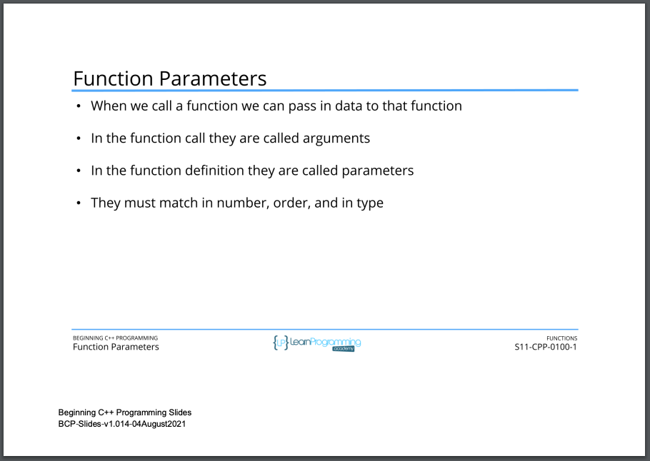
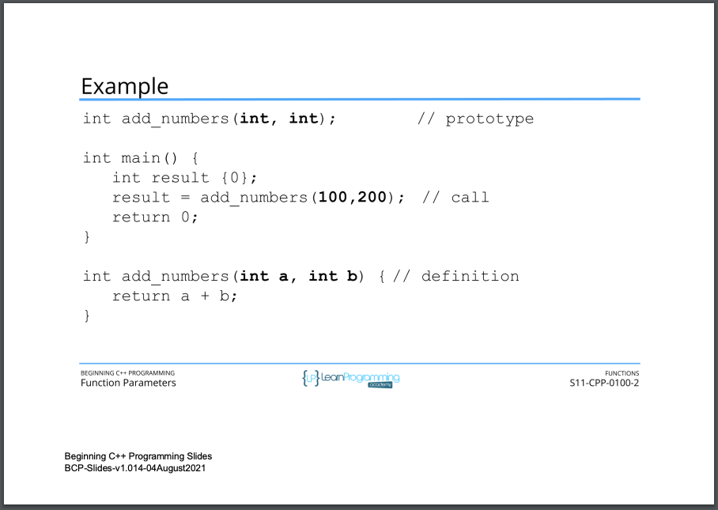
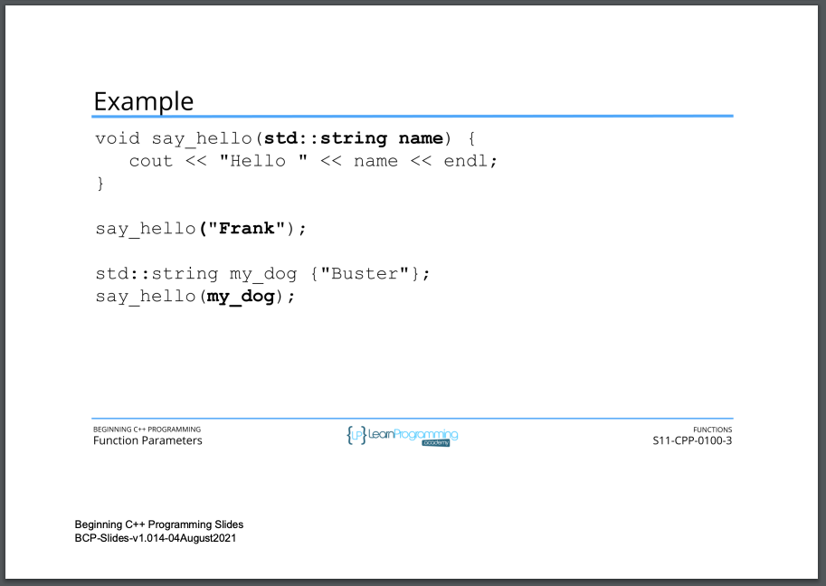
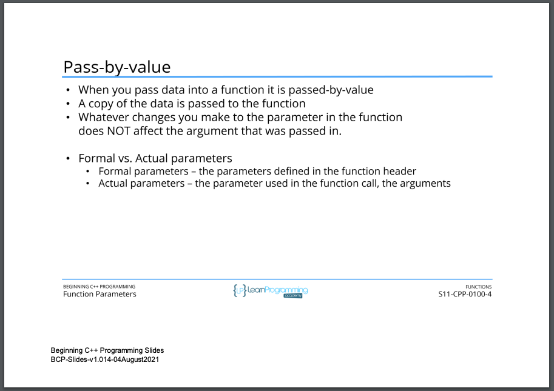
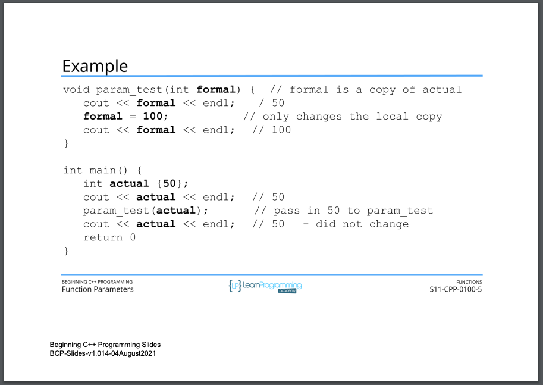
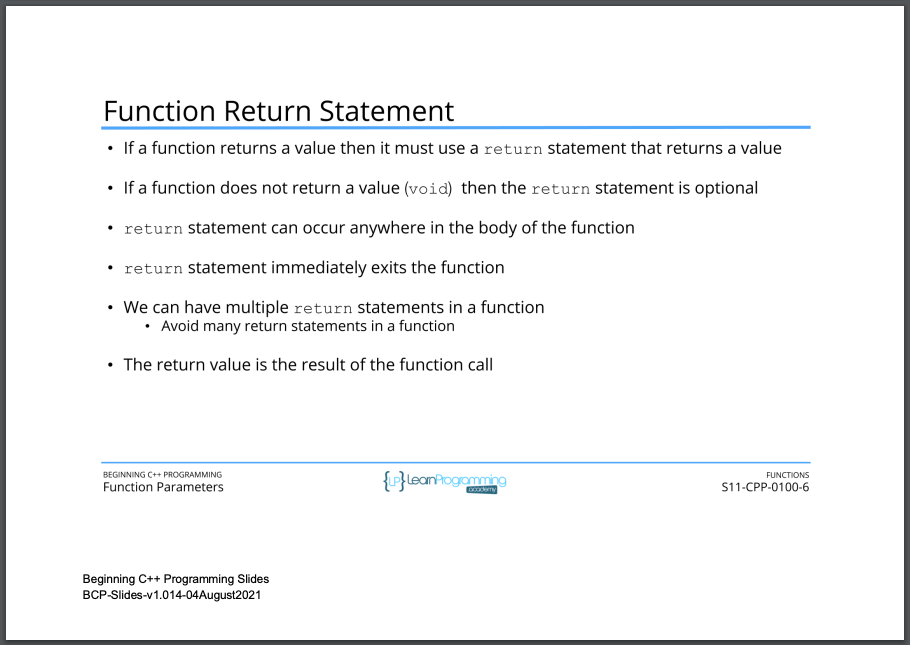

# 105. Function Parameters and the return Statement (p240)

-   [summary of how arguments (actual parameters) are passed to formal parameters in functions in JavaScript, Python, and C++](../codebase/S11_Functions/FunctionParamters/the-summary-of-how-arguments-(actual%20parameters)-are-passed-to-formal-parameters-in-functions-in-JavaScript-Python-and-Cpp.md)

<p align="center" >
     
     
     
     
     
     
         
</p> 

<details>
  <summary> Section 11: Functions </summary>

  -   using `g++`
  ```
  g++ -Wall -std=c++14 main.cpp  
  ```
  - using `-Wextra` and `-Wpedantic` options enable additional warning checks beyond the `-Wall` option, e.g. `-Wmisleading-indentation`
  ```
  g++ -Wall -Wextra -Wpedantic -Wmisleading-indentation -std=c++17 main.cpp
  ```

  - [Codebase: 105. Function Parameters and the return Statement](../codebase/S11_Functions/FunctionParamters/)  
</details>


---

[Previous](./104_Function-Prototypes.md) | [Next](./106_Default-Argument-Values.md)