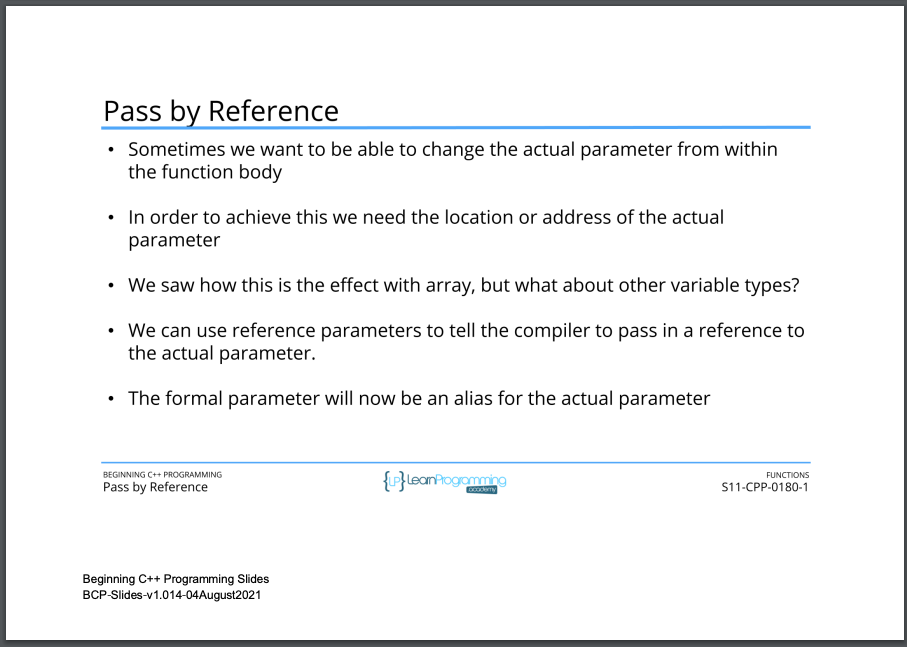
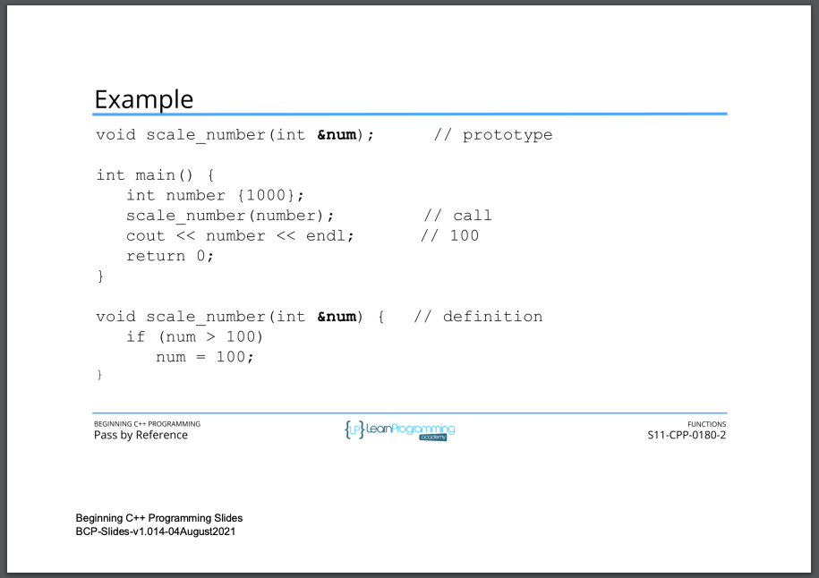
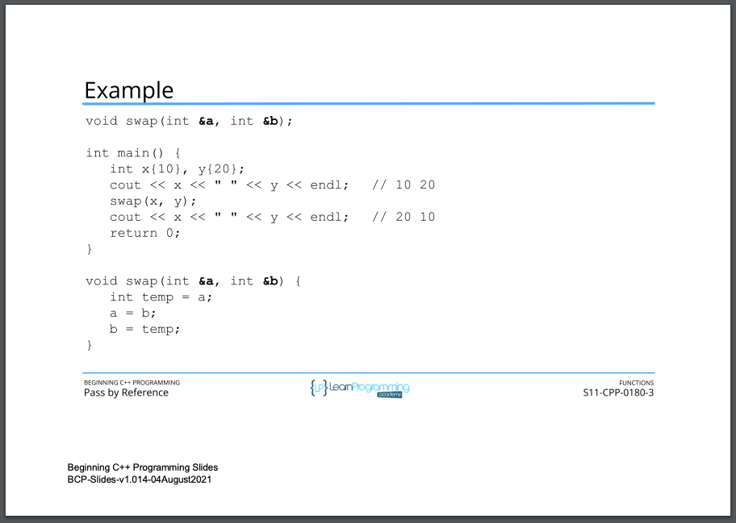
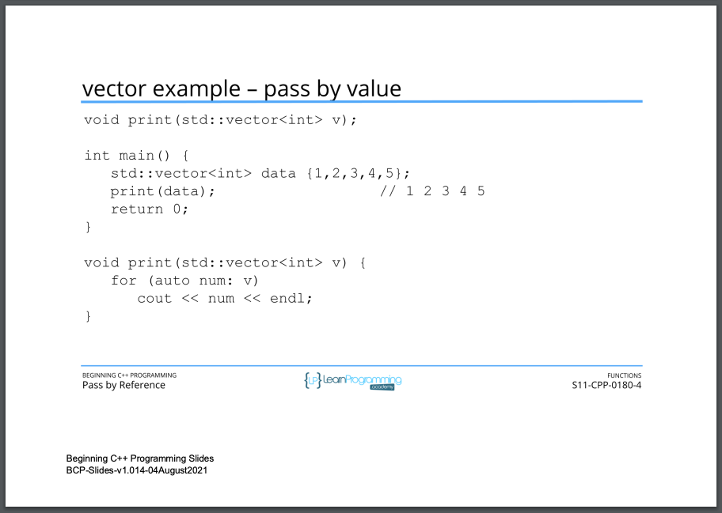
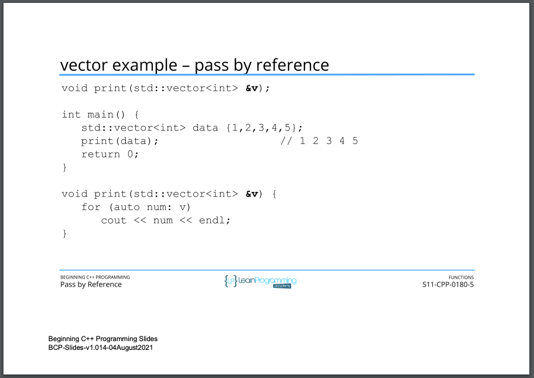
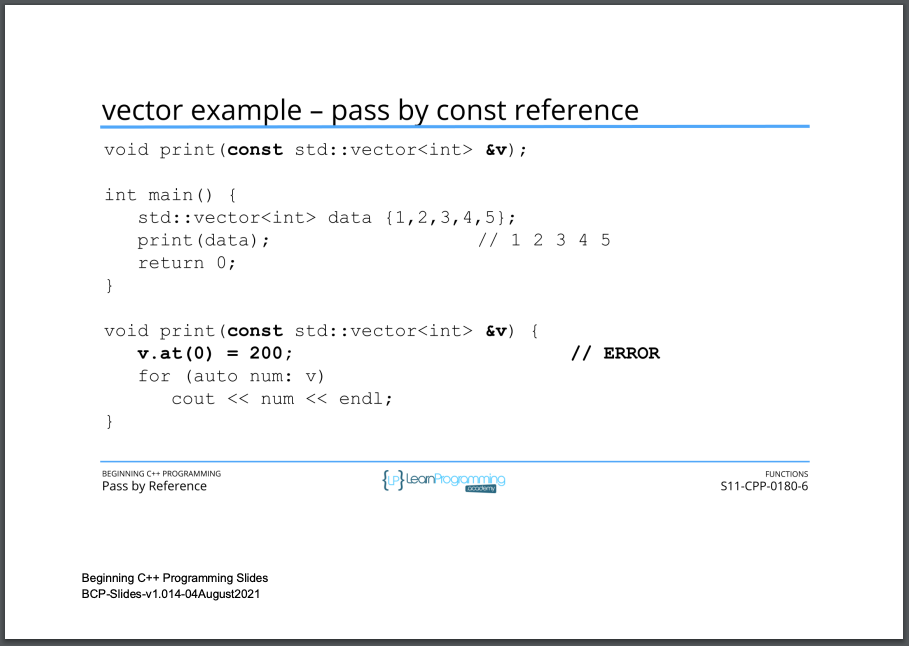

# 109. Pass by Reference (p260)

<p align="center" >
         
     
     
         
         
         
          
</p> 

<details>
  <summary> Section 11: Functions </summary>

  -   using `g++`
  ```
  g++ -Wall -std=c++14 main.cpp  
  ```
  - using `-Wextra` and `-Wpedantic` options enable additional warning checks beyond the `-Wall` option, e.g. `-Wmisleading-indentation`
  ```
  g++ -Wall -Wextra -Wpedantic -Wmisleading-indentation -std=c++17 main.cpp
  ```

  - [Codebase: 109. Pass by Reference](../codebase/S11_Functions/PassByReference/)  
</details>


---

[Previous](./108_Passing-Arrays-to-Functions.md) | [Next](./110_Scope-Rules.md)
