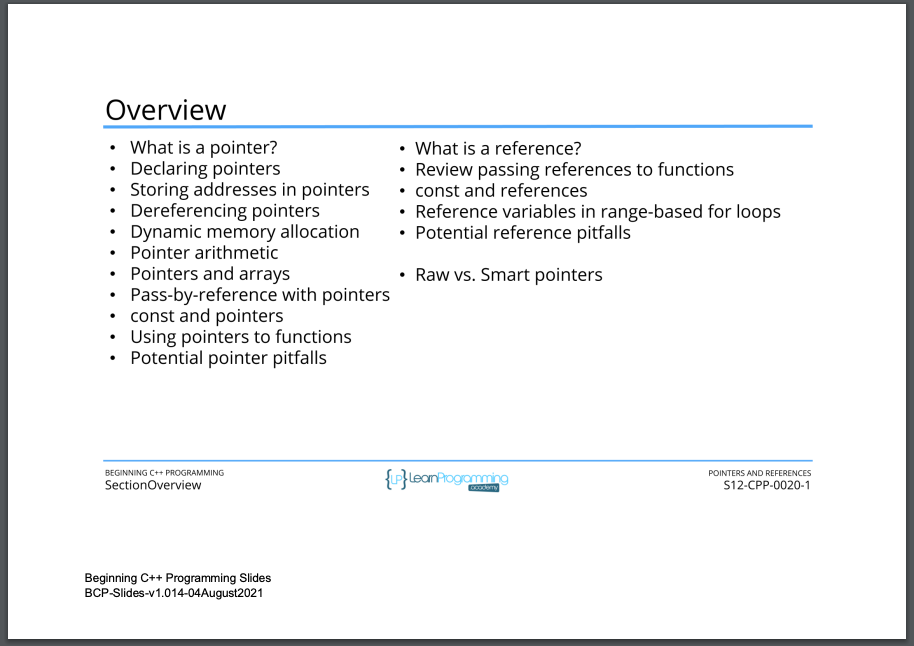

# 116. Section Overview (p279)

<p align="center" >
     
               
</p> 


<details>
  <summary> Section 12: Pointers and References </summary>

  -   using `g++`
  ```
  g++ -Wall -std=c++14 main.cpp  
  ```
  - using `-Wextra` and `-Wpedantic` options enable additional warning checks beyond the `-Wall` option, e.g. `-Wmisleading-indentation`
  ```
  g++ -Wall -Wextra -Wpedantic -Wmisleading-indentation -std=c++17 main.cpp
  ```

  - [Codebase: 116. Section Overview](../codebase/S12_Pointers-and-References/)  

</details>


---

[Previous](./115_Section-Challenge-Solution.md) | [Next](./117_What-is-a-Pointer%3F.md)