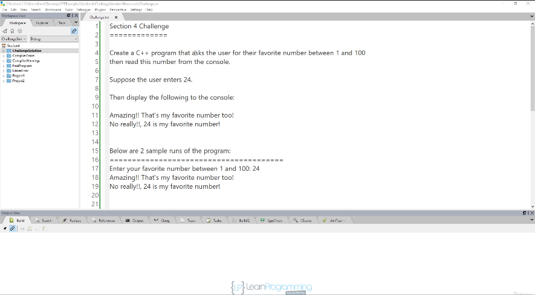
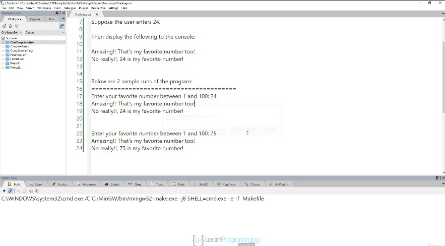

# 34. Section Challenge

<p align="center" >
    
    
</p> 

<details>
  <summary> Section 4: Getting Started </summary>

  -   using `g++`
  ```
  g++ -Wall -std=c++14 main.cpp  
  ```

  - [Codebase: chanllenge](../codebase/S4_Getting-Started/chanllenge/)

</details>


---

[Previous](./33_What-are-Logic-Errors%3F.md) | [Next](./35_Section-Challenge-Solution.md)