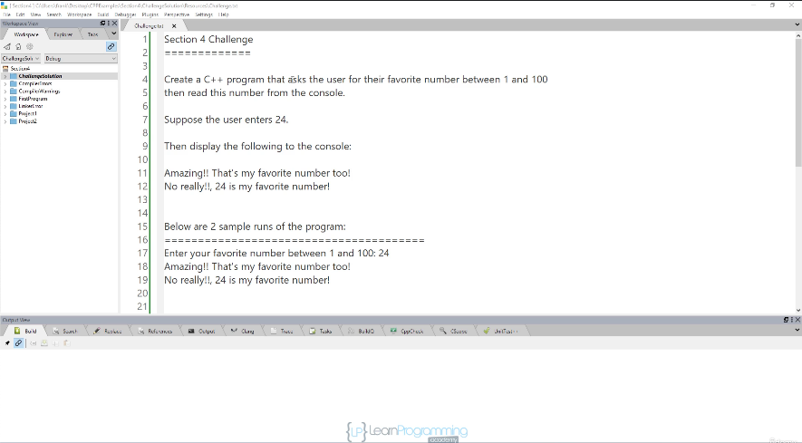
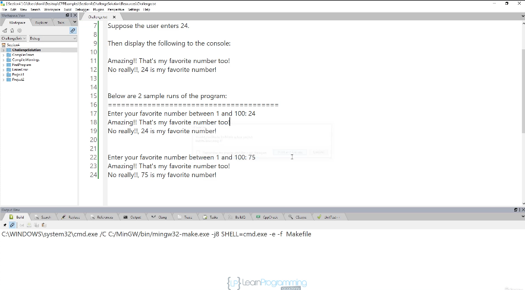

# 35. Section Challenge - Solution (p33)

<p align="center" >
    
    
</p> 

<details>
  <summary> Section 4: Getting Started </summary>

  -   using `g++`
  ```
  g++ -Wall -std=c++14 main.cpp  
  ```

  - [Codebase: chanllenge](../codebase/S4_Getting-Started/chanllenge/)

</details>


---

[Previous](./34_Section-Challenge.md) | [Next](./36_Section-Overview.md)