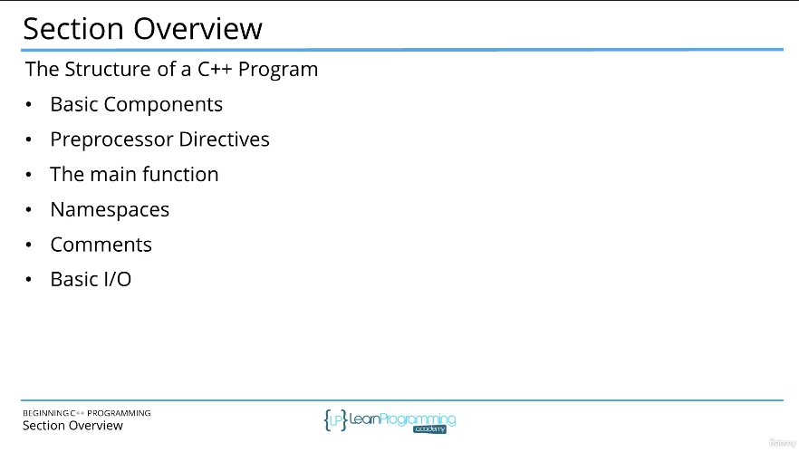

# 36. Section Overview

<p align="center" >
    
</p> 

<details>
  <summary> Section 5: Structure of a C++ Program </summary>

  -   using `g++`
  ```
  g++ -Wall -std=c++14 main.cpp  
  ```

  - [Codebase: ](../codebase/S5_Structure-of-a-Cpp-Program.md/)

</details>


---

[Previous](./35_Section-Challenge-Solution.md) | [Next]()