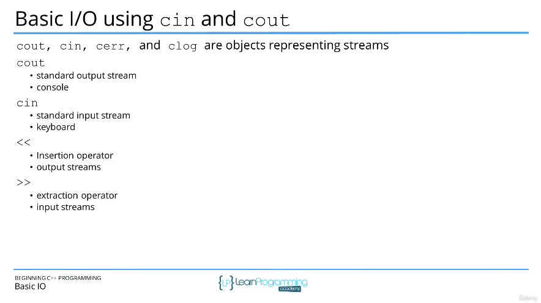
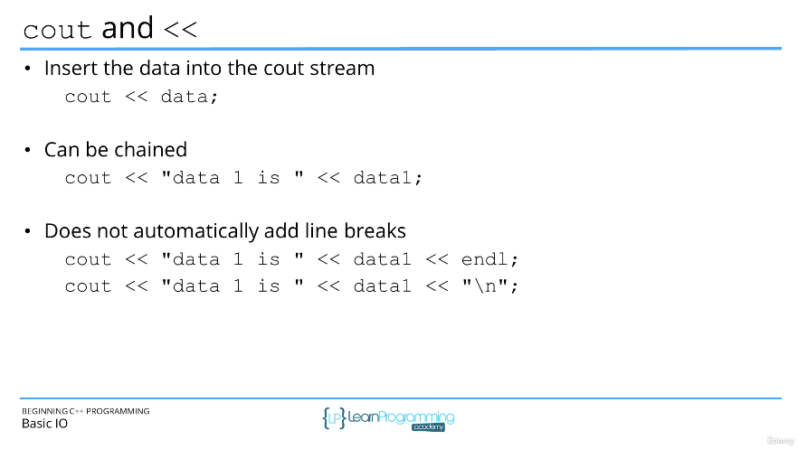
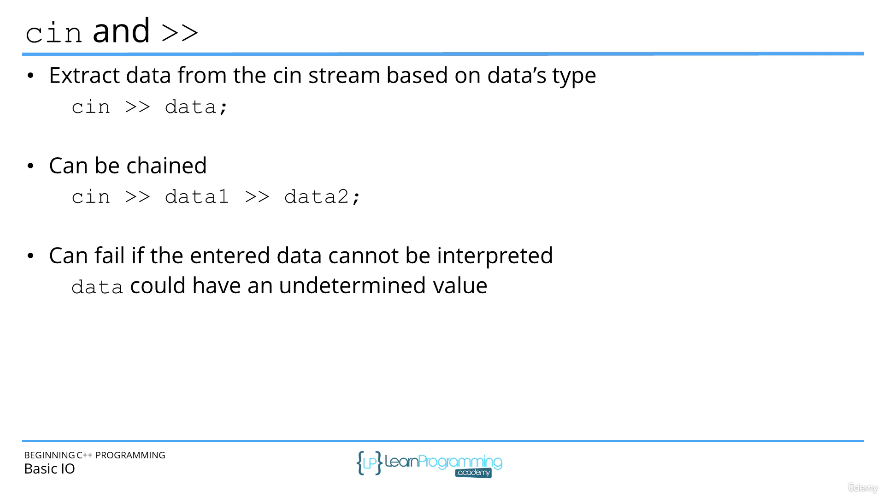

# 42. Basic Input and Output (I/O) using cin and cout (p43)

<p align="center" >
    
    
    
</p> 

<details>
  <summary> Section 5: Structure of a C++ Program </summary>

  -   using `g++`
  ```
  g++ -Wall -std=c++14 main.cpp  
  ```

  - [Codebase: 42. Basic Input and Output (I/O) using cin and cout](../codebase/S5_Structure-of-a-Cpp-Program.md/BasicIO/)

</details>


---

[Previous](./41_Namespaces.md) | [Next](./43_Section-Overview.md)