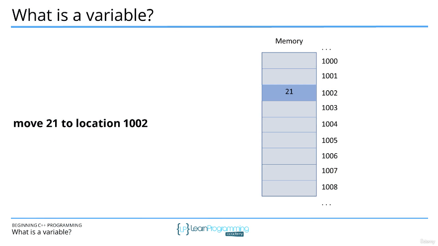
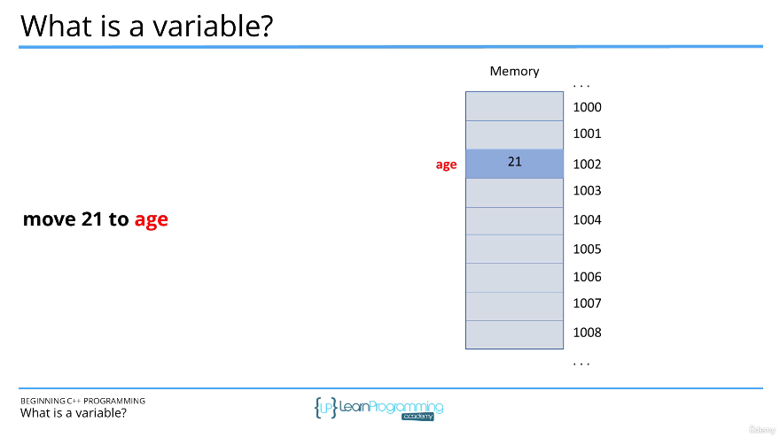
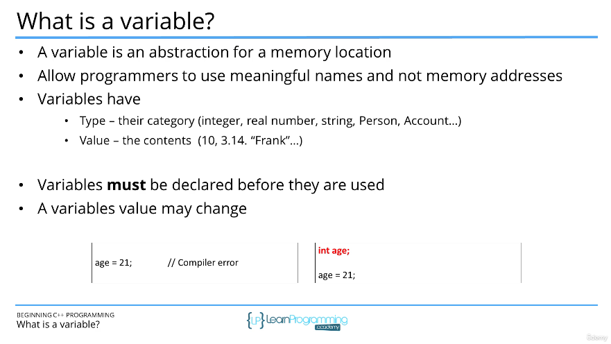

# 44. What is a variable? (p48)

<p align="center" >
    
    
    
</p> 

<details>
  <summary> Section 6: Variables and Constants </summary>

  -   using `g++`
  ```
  g++ -Wall -std=c++14 main.cpp  
  ```

  - [Codebase: 44. What is a variable?](../codebase/S6_Variables-and-Constants/)

</details>


---

[Previous](./43_Section-Overview.md) | [Next](./45_Declaring-and-Initializing-Variables.md)