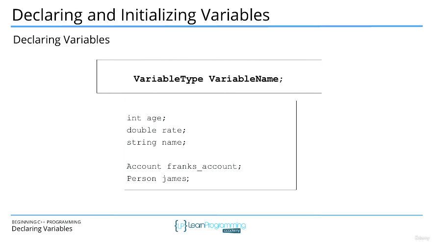
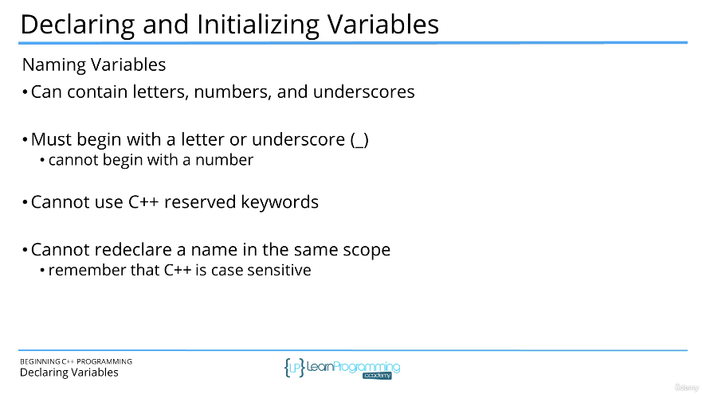
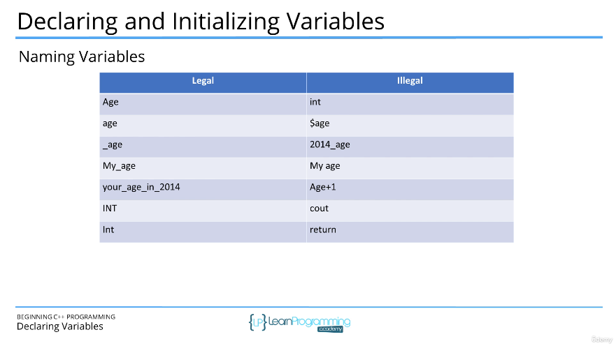
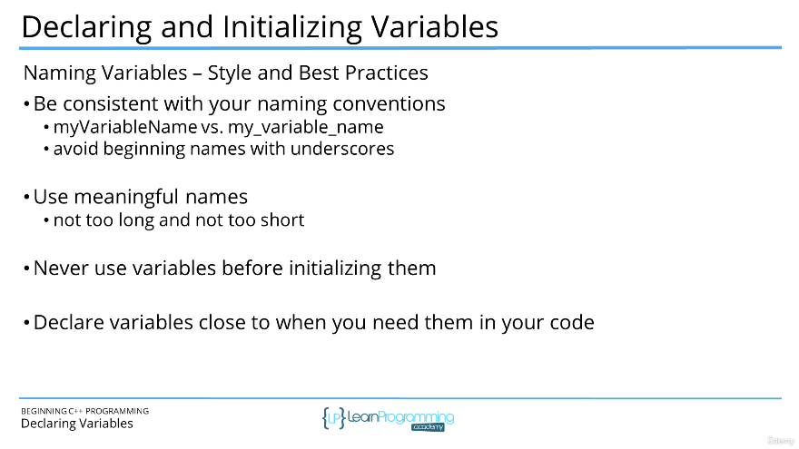
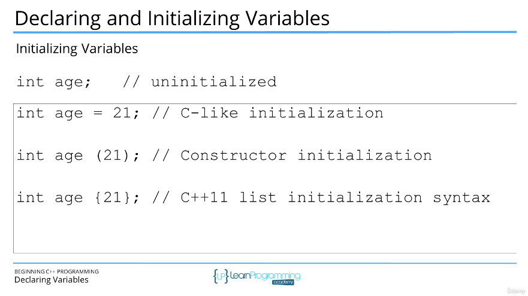

# 45. Declaring and Initializing Variables

<p align="center" >
    
    
    
    
    
</p> 

<details>
  <summary> Section 6: Variables and Constants </summary>

  -   using `g++`
  ```
  g++ -Wall -std=c++14 main.cpp  
  ```

  - [Codebase: 45. Declaring and Initializing Variables](../codebase/S6_Variables-and-Constants/InitializingVariables/)

</details>


---

[Previous](./44_What-is-a-variable%3F.md) | [Next](./46_Global-Variables.md)