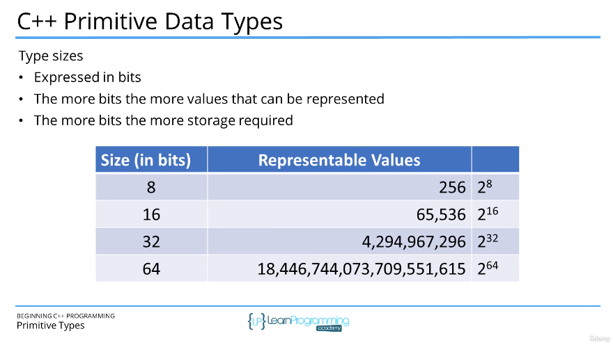

# 47. C++ Built-in Primitive Types

-   [Errata-47.pdfIn](https://beatlesm.s3.us-west-1.amazonaws.com/beginning-cpp-programming-from-beginner-to-beyond/Errata-47.pdf)

<p align="center" >
    
    
    
    
    
    
    

</p> 

<details>
  <summary> Section 6: Variables and Constants </summary>

  -   using `g++`
  ```
  g++ -Wall -std=c++14 main.cpp  
  ```

  - [Codebase: 47. C++ Built-in Primitive Types](../codebase/S6_Variables-and-Constants/PrimitiveTypes/)

</details>


---

[Previous](./46_Global-Variables.md) | [Next](./48_What-is-the-Size-of-a-Variable-(sizeof).md)