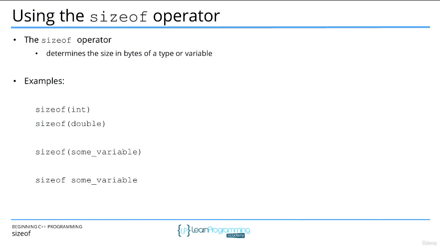
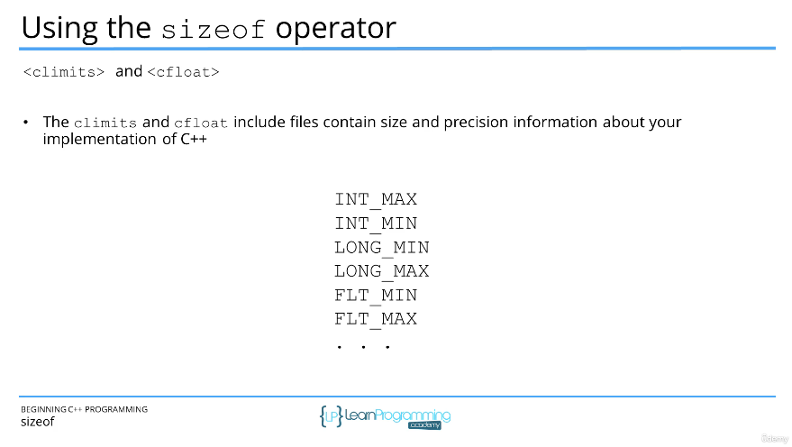

# 48. What is the Size of a Variable (sizeof) (p83)

<p align="center" >
    
    

</p> 

<details>
  <summary> Section 6: Variables and Constants </summary>

  -   using `g++`
  ```
  g++ -Wall -std=c++14 main.cpp  
  ```

  - [Codebase: 48. What is the Size of a Variable (sizeof)](../codebase/S6_Variables-and-Constants/SizeofOperator/)

</details>


---

[Previous](./47_Cpp-Built-in-Primitive-Types.md) | [Next](./49_What-is-a-Constant%3F.md)