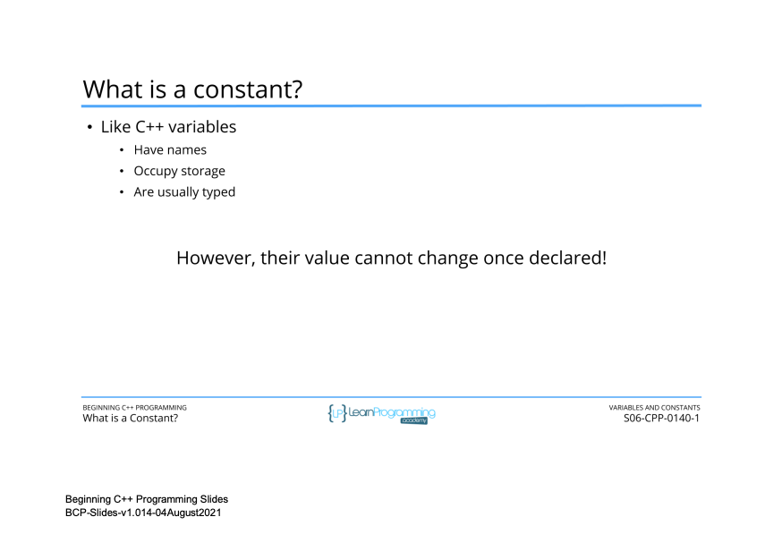
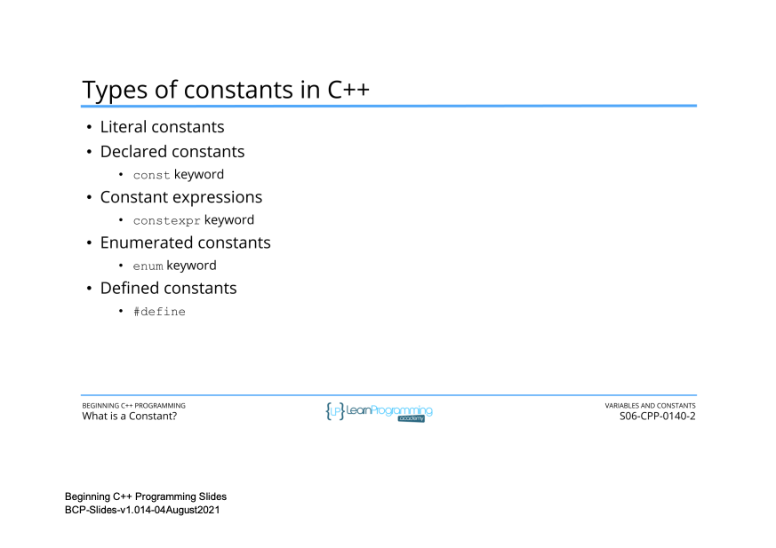
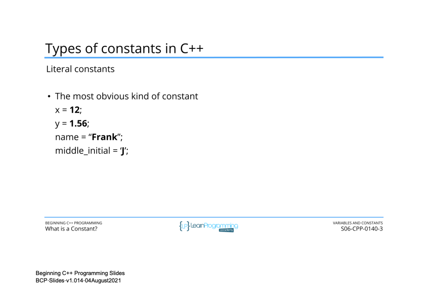
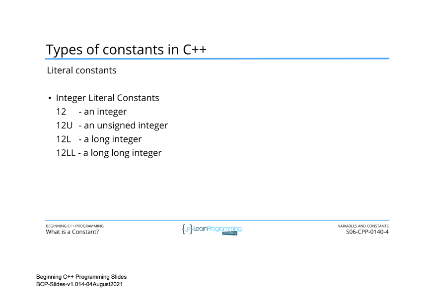
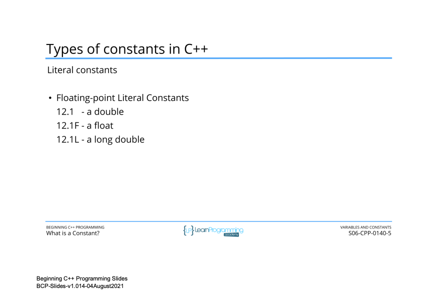
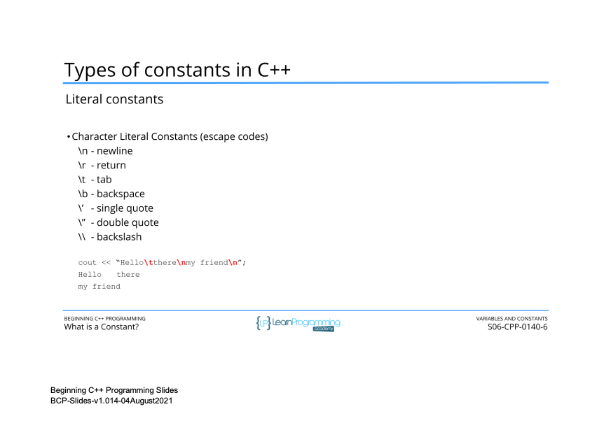
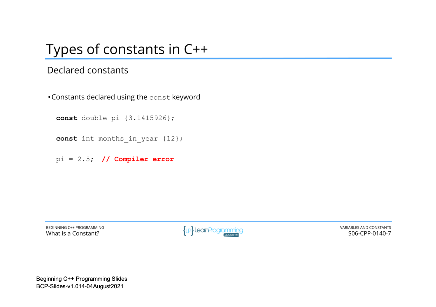
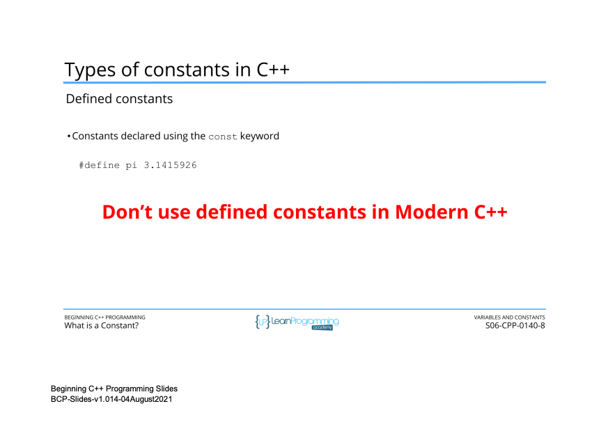

# 49. What is a Constant? (p65)

<p align="center" >
     <br>
      <br>
      <br>
    
    
    
    
    
</p> 

<details>
  <summary> Section 6: Variables and Constants </summary>

  -   using `g++`
  ```
  g++ -Wall -std=c++14 main.cpp  
  ```

  - [Codebase: 49. What is a Constant?](../codebase/S6_Variables-and-Constants/Constants/)

</details>


---

[Previous](./48_What-is-the-Size-of-a-Variable-(sizeof).md) | [Next](./50_Declaring-and-Using-Constants.md)