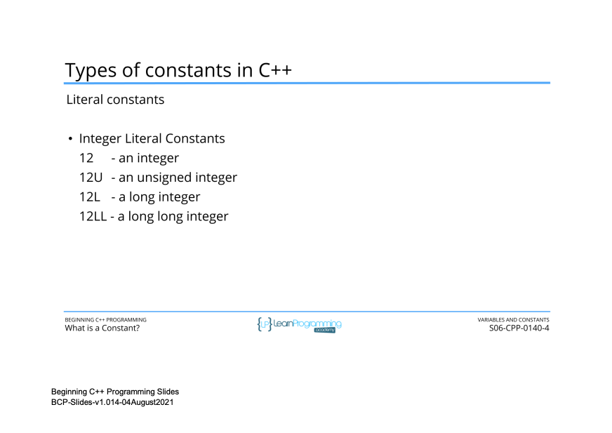
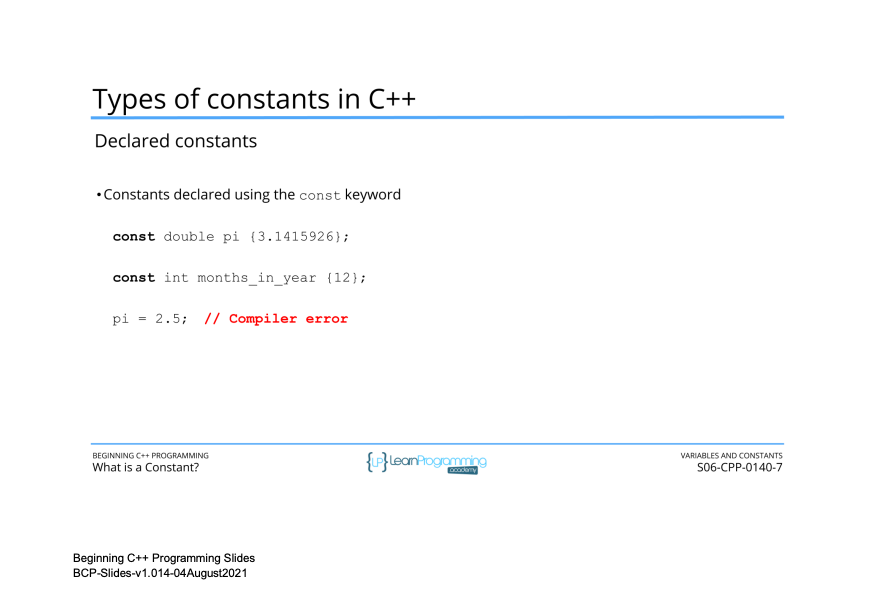

# 50. Declaring and Using Constants

<p align="center" >
     <br>
      <br>
      <br>
    
    
    
    
    
</p> 

<details>
  <summary> Section 6: Variables and Constants </summary>

  -   using `g++`
  ```
  g++ -Wall -std=c++14 main.cpp  
  ```

  - [Codebase: 50. Declaring and Using Constants](../codebase/S6_Variables-and-Constants/Constants/)

</details>


---

[Previous](./49_What-is-a-Constant%3F.md) | [Next]()