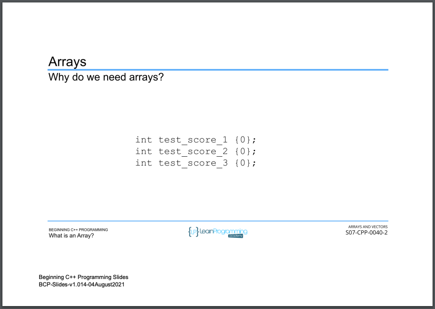
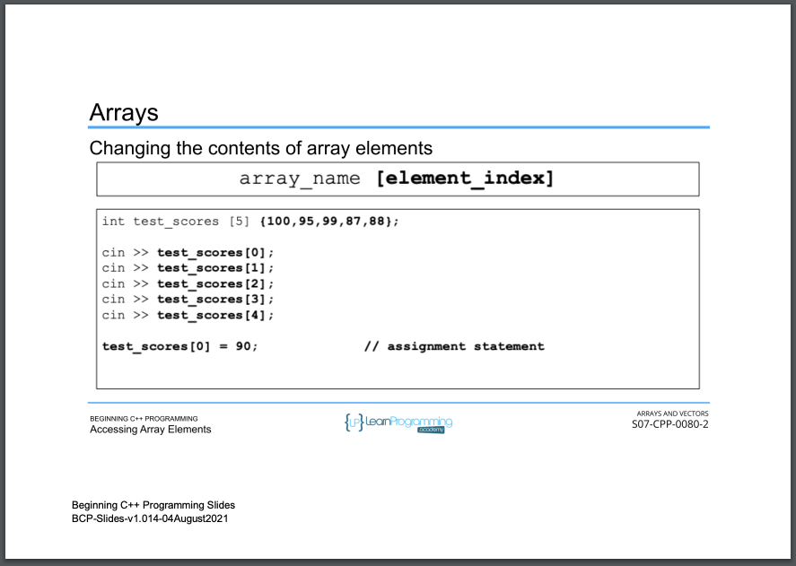
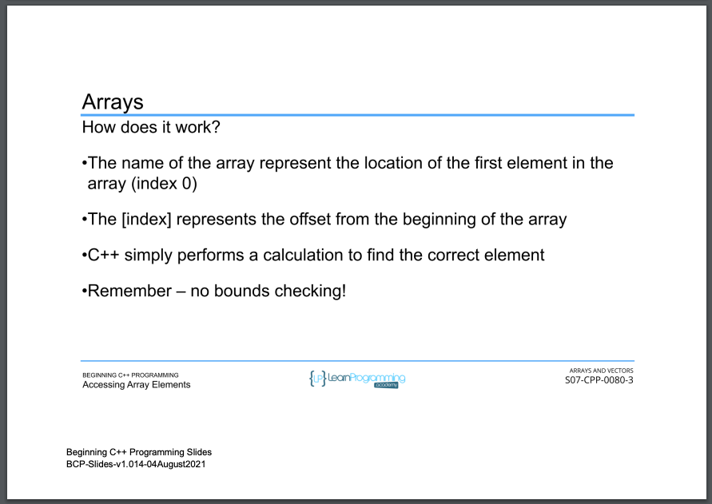
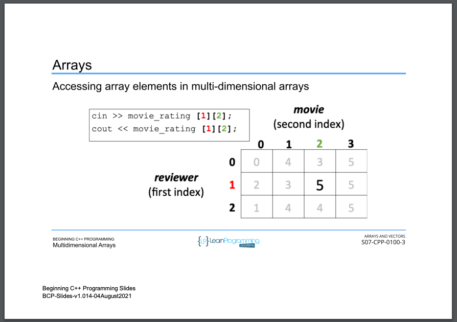

# 54. What is an Array? (p74)

-   [C++11 - What's new?](./0_C%2B%2B11.md)

-   [How to replicate map, filter and reduce behaviors in C++ using STL?](../codebase/S7_Arrays-and-Vectors/How-to-replicate-map-filter-and-reduce-behaviors-in-Cpp-using-STL.md)

-   [Deep in `std::for_each` algorithm vs `range-based` for loop?](../codebase/S7_Arrays-and-Vectors/Deep-in%20-std_for_each-algorithm-vs-range-based-for-loop%3F.md)

<p align="center" >
     
     
     
     
     
     
     
     
     
     
     
     
     
</p> 

<details>
  <summary> Section 7: Arrays and Vectors </summary>

  -   using `g++`
  ```
  g++ -Wall -std=c++14 main.cpp  
  ```

  - [Codebase: 54. What is an Array?](../codebase/S7_Arrays-and-Vectors/Arrays/)

</details>

<details>
  <summary> `for_each`, `range_based_forloop`, `map`, `filter` and `reduce` </summary>

  -   using `g++`
  ```
  g++ -Wall -std=c++14 main.cpp  
  ```
  - using `-Wextra` and `-Wpedantic` options enable additional warning checks beyond the `-Wall` option, e.g. `-Wmisleading-indentation`
  ```
  g++ -Wall -Wextra -Wpedantic -Wmisleading-indentation -std=c++17 main.cpp
  ```

  - [Codebase: Section 7: Arrays and Vectors - Map](../codebase/S7_Arrays-and-Vectors/Map)
  - [Codebase: Section 7: Arrays and Vectors - Filter](../codebase/S7_Arrays-and-Vectors/Filter)
  - [Codebase: Section 7: Arrays and Vectors - Reduce](../codebase/S7_Arrays-and-Vectors/Reduce)
  - [Codebase: Section 7: Arrays and Vectors - std-for_each](../codebase/S7_Arrays-and-Vectors/std-for_each)
  - [Codebase: Section 7: Arrays and Vectors - RangeBasedForLoop](../codebase/S7_Arrays-and-Vectors/range-based-for-loop)
  - [Codebase: Section 9: Controlling Program Flow - RangeBasedForLoop](../S9_Controlling-Program-Flow/RangeBasedForLoop/)
</details>


---

[Previous](./53_Section-Overview.md) | [Next](./55_Declaring-and-Initializing-Arrays.md)
