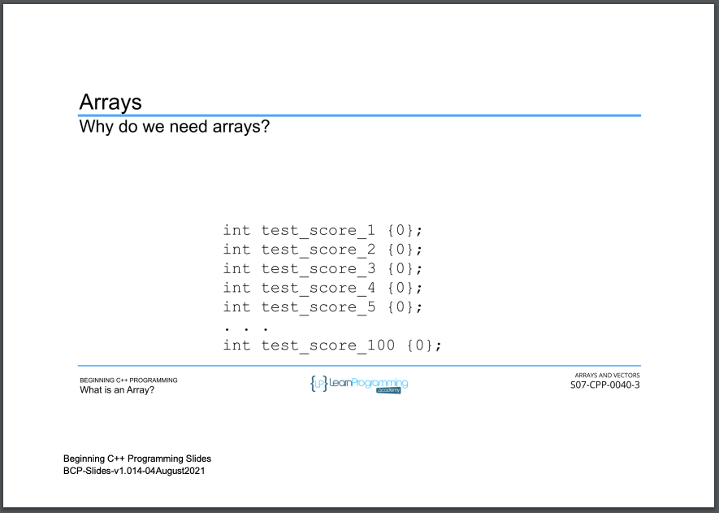
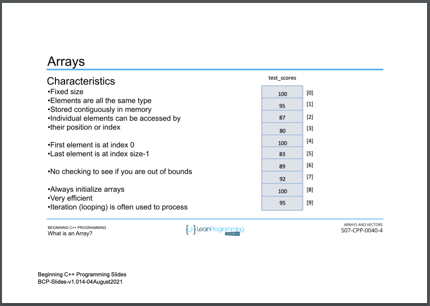
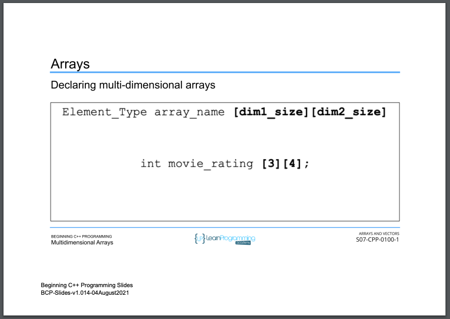

# 57. Multidimensional Arrays

<p align="center" >
     
     
     
     
     
     
     
     
     
     
     
     
     
</p> 

<details>
  <summary> Section 7: Arrays and Vectors </summary>

  -   using `g++`
  ```
  g++ -Wall -std=c++14 main.cpp  
  ```

  - [Codebase: 57. Multidimensional Arrays](../codebase/S7_Arrays-and-Vectors/Arrays/)

</details>


---

[Previous](./56_Accessing-and-Modifying-Array-Elements.md) | [Next](./58_Declaring-and-Initializing-Vectors.md)