# 58. Declaring and Initializing Vectors

<p align="center" >
    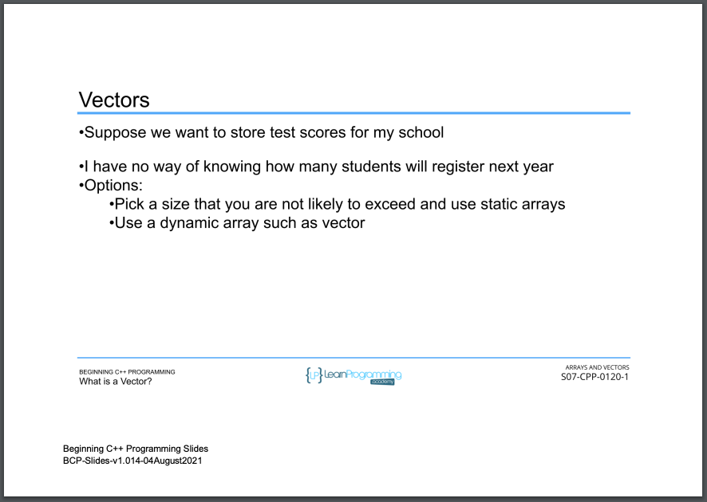 
    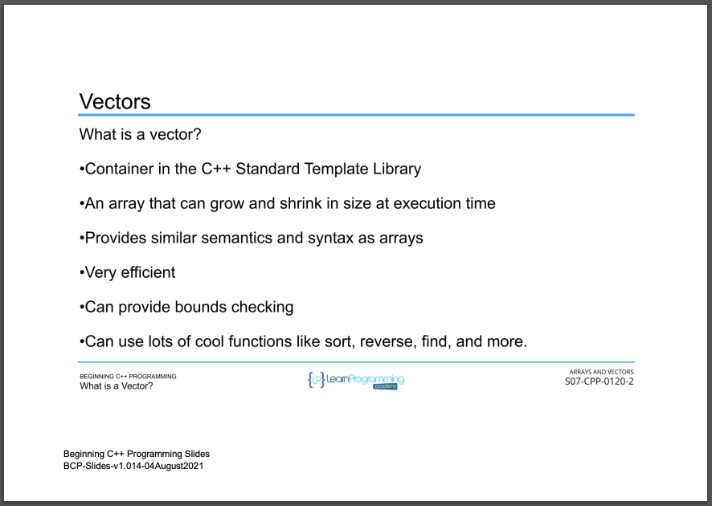 
    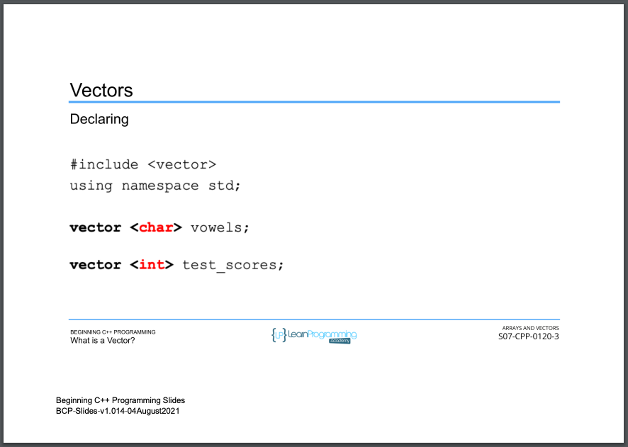 
    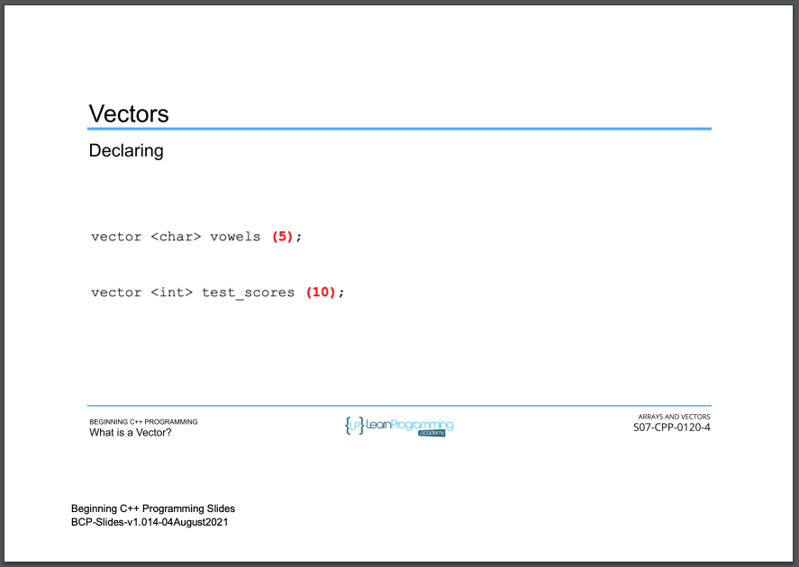 
    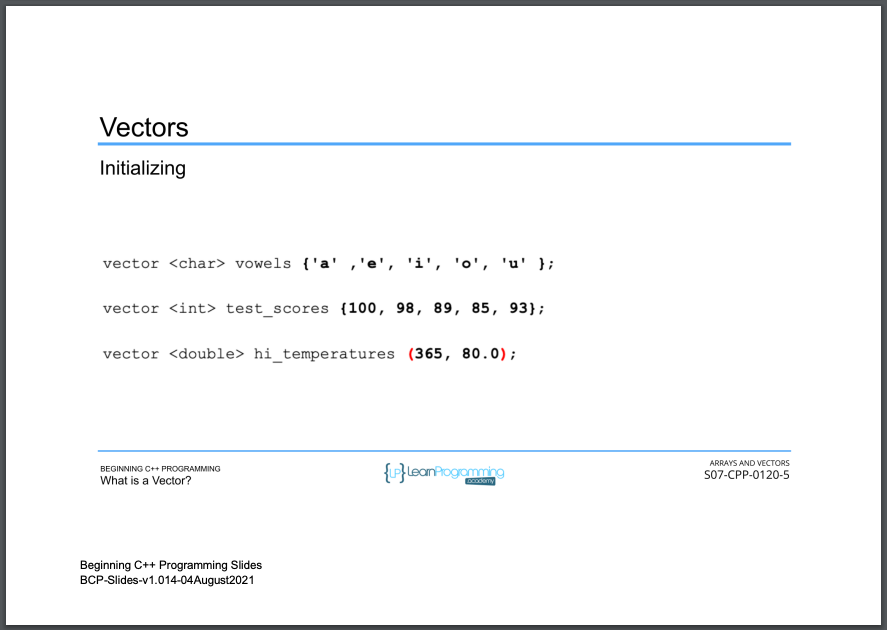 
    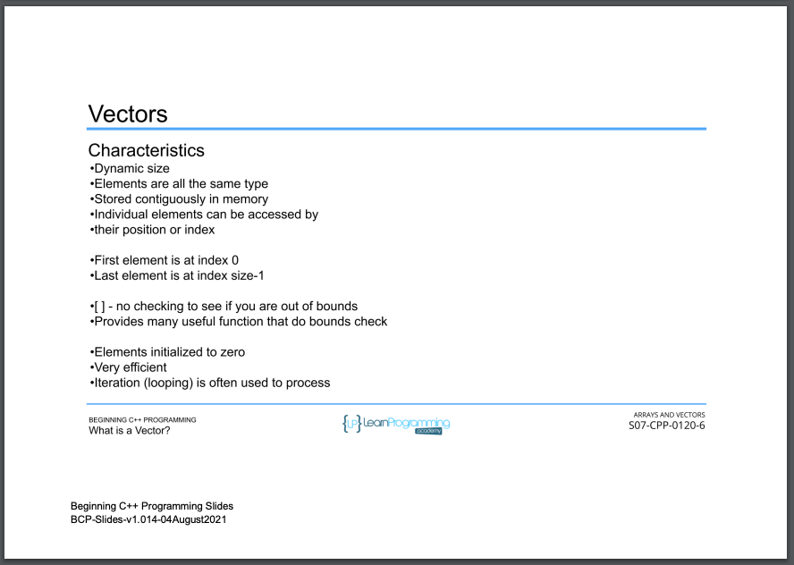 
    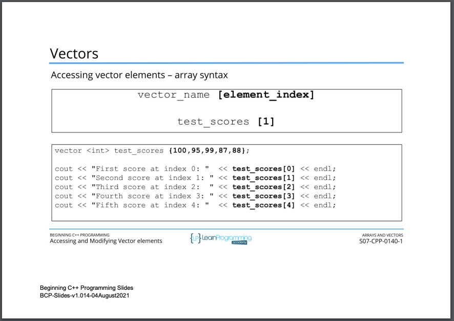 
    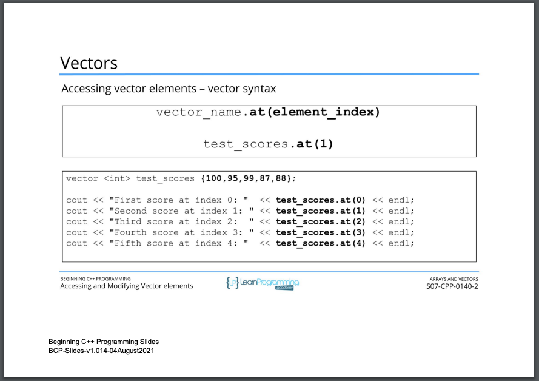 
    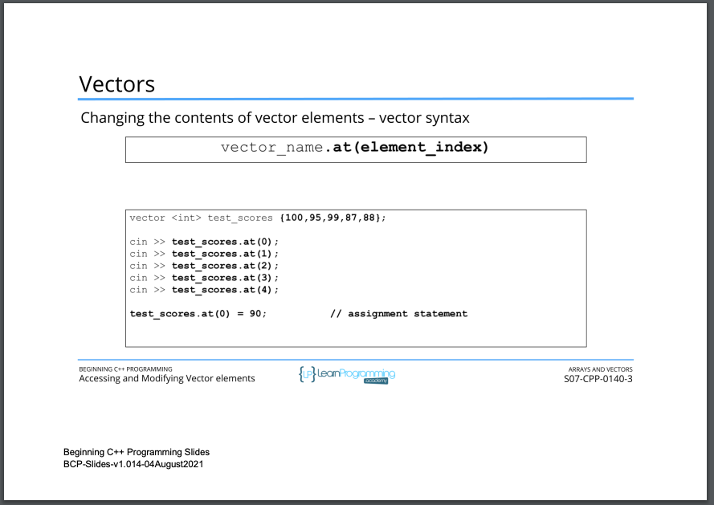 
    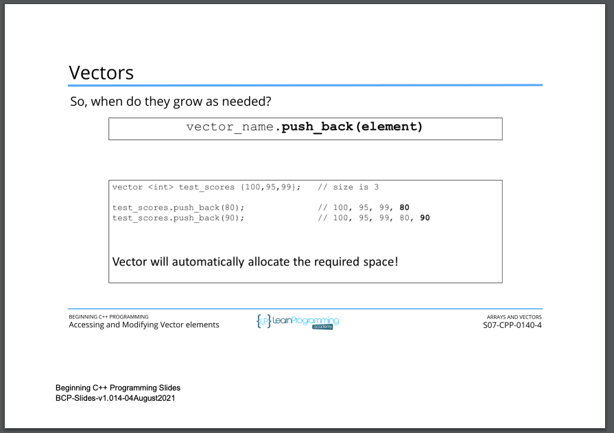 
    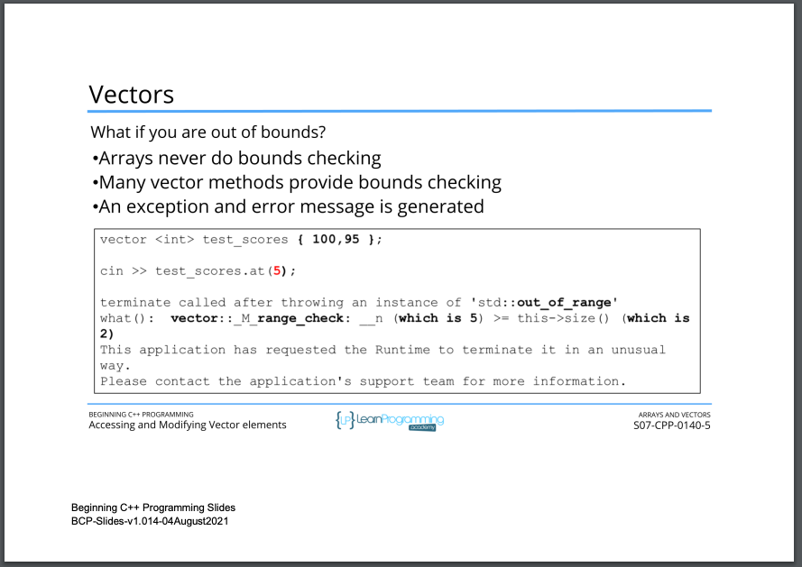 
</p> 

<details>
  <summary> Section 7: Arrays and Vectors </summary>

  -   using `g++`
  ```
  g++ -Wall -std=c++14 main.cpp  
  ```

  - [Codebase: 58. Declaring and Initializing Vectors](../codebase/S7_Arrays-and-Vectors/Vectors/)

</details>


---

[Previous](./57_Multidimensional-Arrays.md) | [Next](./59_Accessing-and-Modifying-Vector-Elements.md)