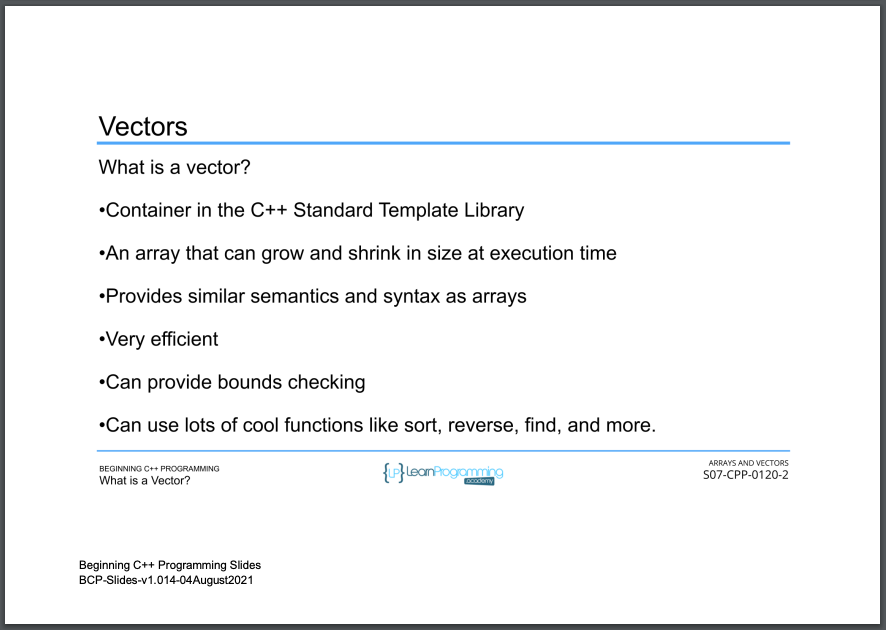
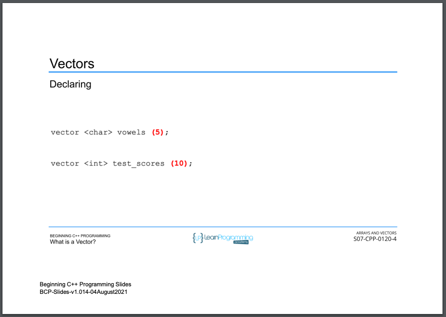
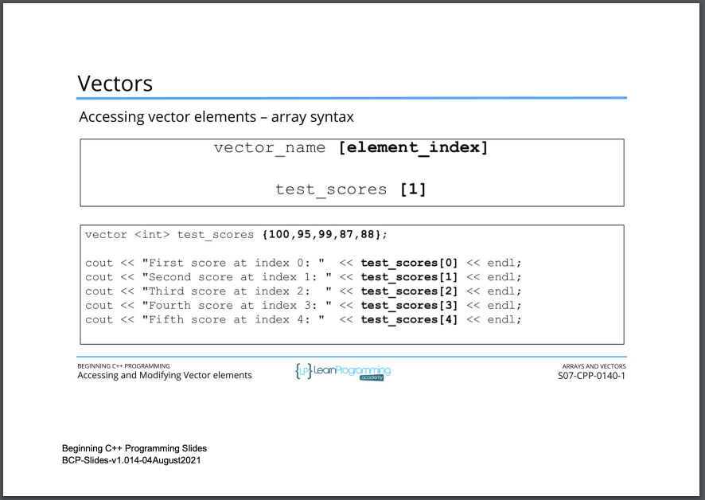
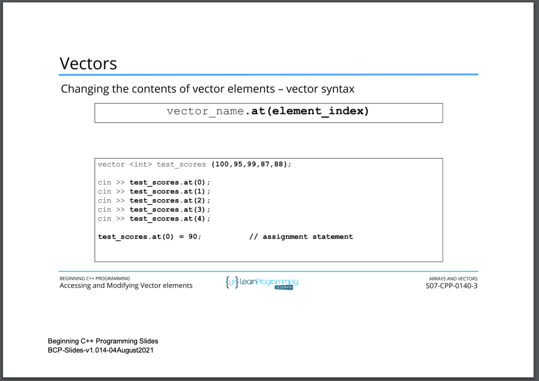
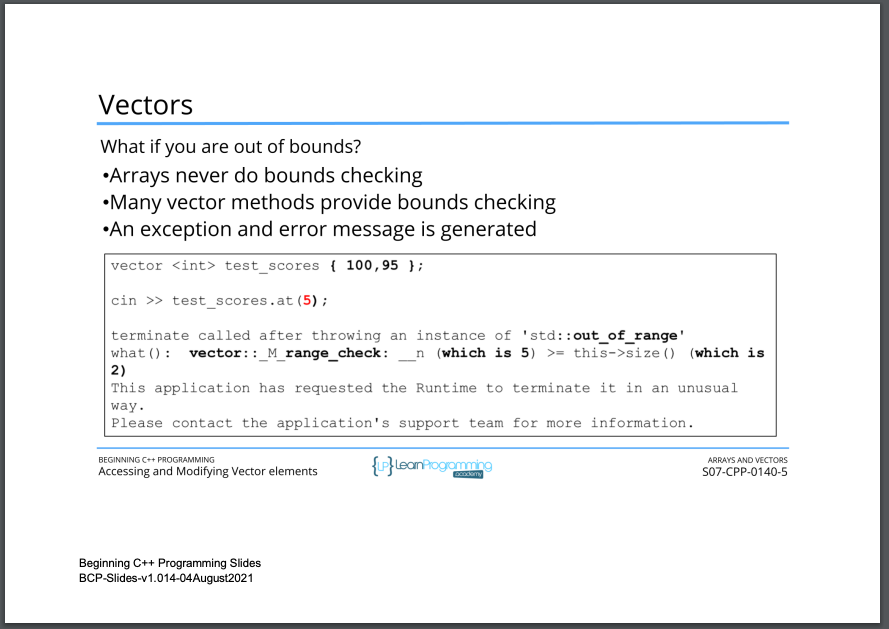

# 59. Accessing and Modifying Vector Elements

<p align="center" >
     
     
     
     
     
     
     
     
     
     
     
</p> 

<details>
  <summary> Section 7: Arrays and Vectors </summary>

  -   using `g++`
  ```
  g++ -Wall -std=c++14 main.cpp  
  ```

  - [Codebase: 59. Accessing and Modifying Vector Elements](../codebase/S7_Arrays-and-Vectors/Vectors/)

</details>

<details>
  <summary> How to replicate map, filter and reduce behaviors in C++ using STL? </summary>

  - [How to replicate map, filter and reduce behaviors in C++ using STL?](../codebase/S7_Arrays-and-Vectors/How-to-replicate-map-filter-and-reduce-behaviors-in-Cpp-using-STL.md)

  -   using `g++`
  ```
  g++ -Wall -std=c++14 main.cpp  
  ```

  - [Codebase: Section 7: Arrays and Vectors - Map](../codebase/S7_Arrays-and-Vectors/Map)
  - [Codebase: Section 7: Arrays and Vectors - Filter](../codebase/S7_Arrays-and-Vectors/Filter)
  - [Codebase: Section 7: Arrays and Vectors - Reduce](../codebase/S7_Arrays-and-Vectors/Reduce)

</details>

---

[Previous](./58_Declaring-and-Initializing-Vectors.md) | [Next](./60_Section-Challenge.md)