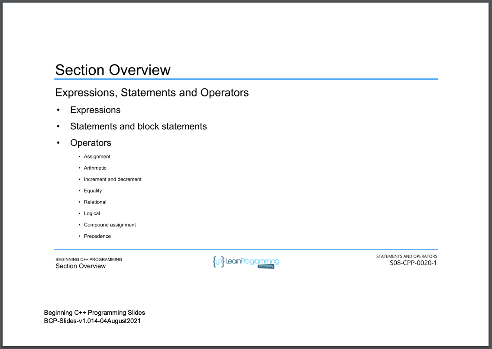
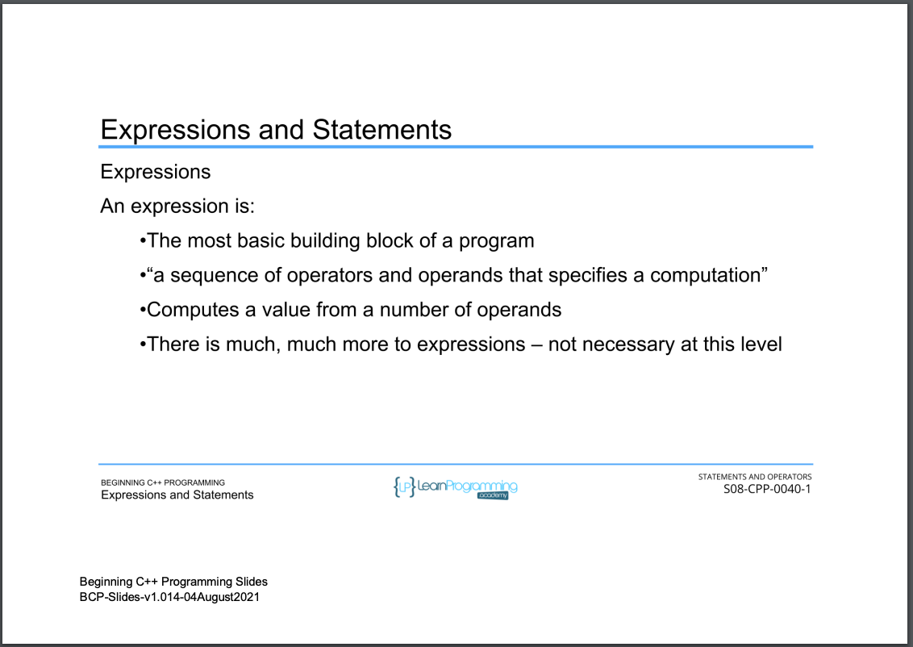
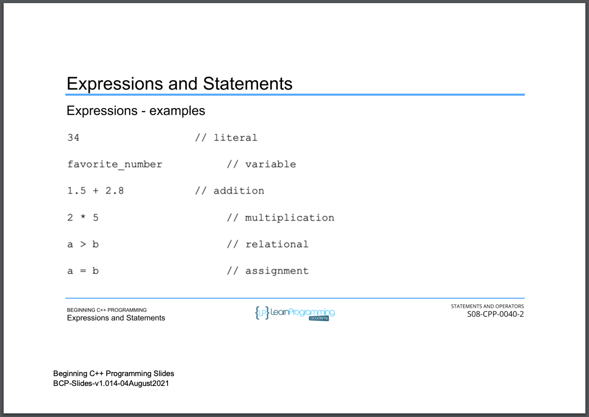
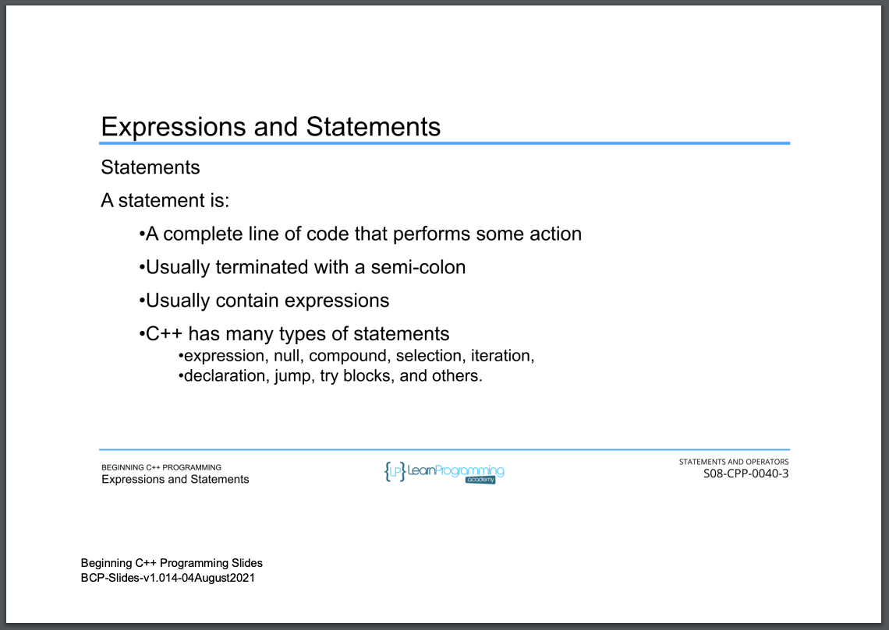
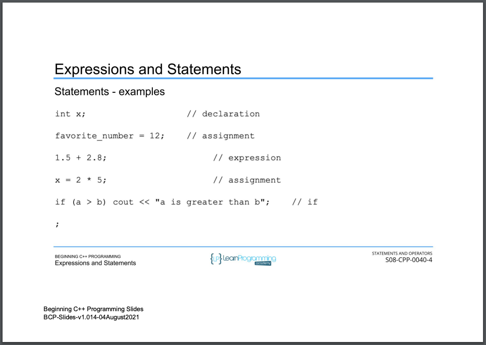

# 62. Section Overview

<p align="center" >
     
     
     
     
        
     
</p> 

<details>
  <summary> Section 8: Statements and Operators </summary>

  -   using `g++`
  ```
  g++ -Wall -std=c++14 main.cpp  
  ```

  - [Codebase: 62. Section Overview](../codebase/S8_Statements-and-Operators/)

</details>


---

[Previous](./61_Section-Challenge-Solution.md) | [Next](./63_Expressions-and-Statements.md)