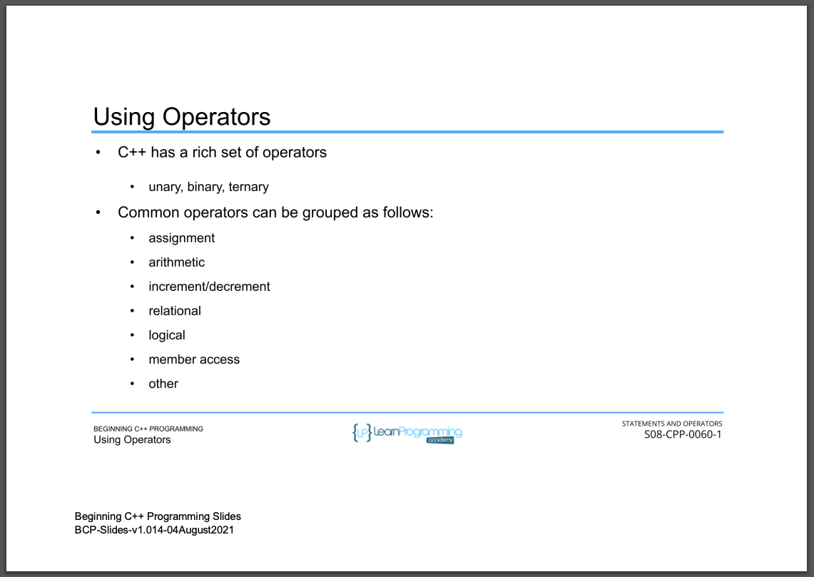

# 64. Using Operators (p103)

<p align="center" >
           
     
</p> 

<details>
  <summary> Section 8: Statements and Operators </summary>

  -   using `g++`
  ```
  g++ -Wall -std=c++14 main.cpp  
  ```

  - [Codebase: 64. Using Operators](../codebase/S8_Statements-and-Operators/)

</details>


---

[Previous](./63_Expressions-and-Statements.md) | [Next](./65_The-Assignment-Operator.md)