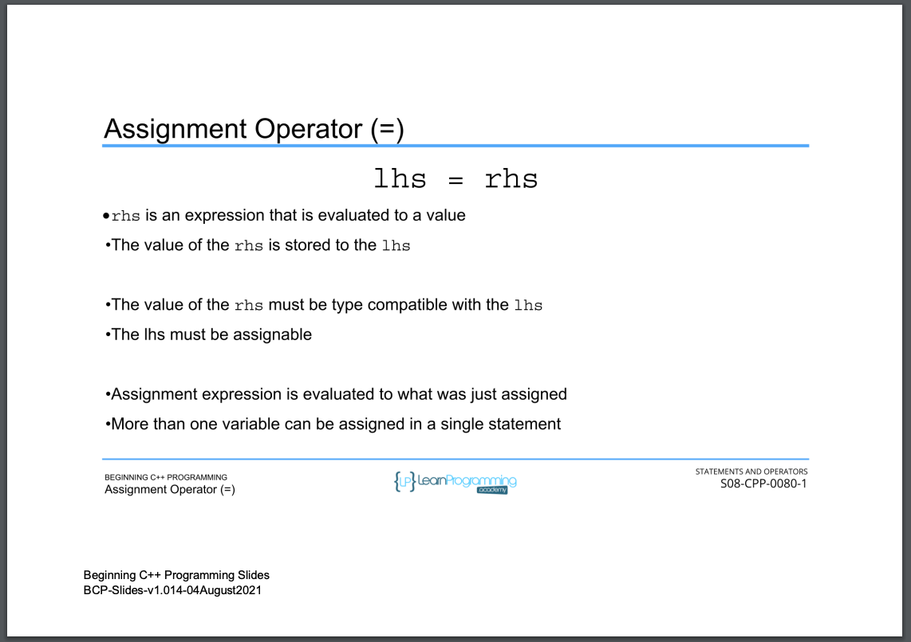

# 65. The Assignment Operator (p104)

<p align="center" >
           
     
</p> 

<details>
  <summary> Section 8: Statements and Operators </summary>

  -   using `g++`
  ```
  g++ -Wall -std=c++14 main.cpp  
  ```

  - [Codebase: 65. The Assignment Operator](../codebase/S8_Statements-and-Operators/AssignmentOperator/)

</details>


---

[Previous](./64_Using-Operators.md) | [Next](./66_Arithmetic-Operators.md)