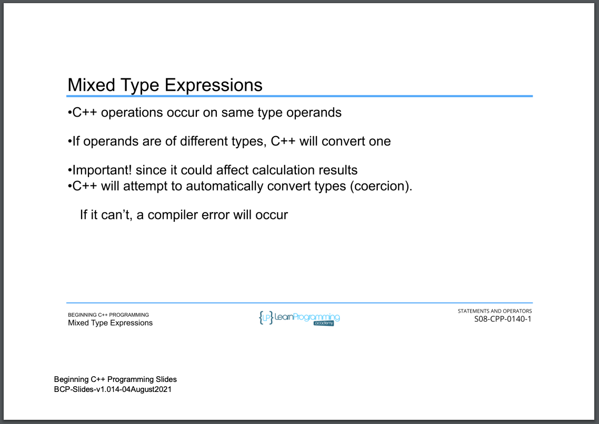
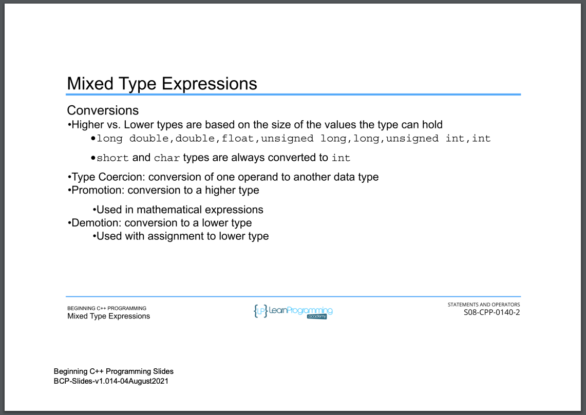
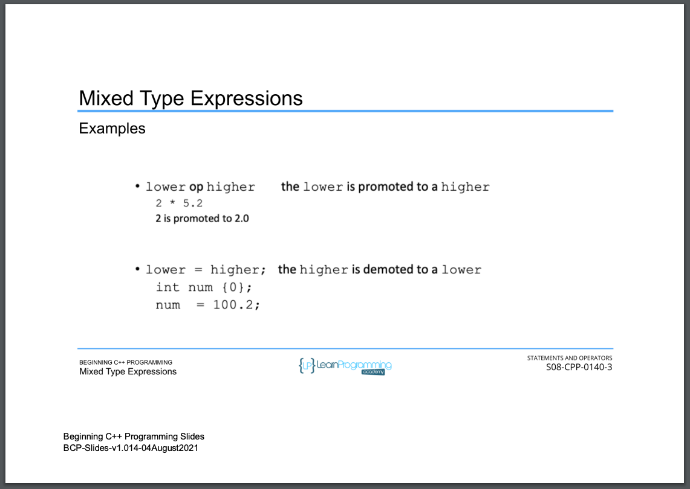
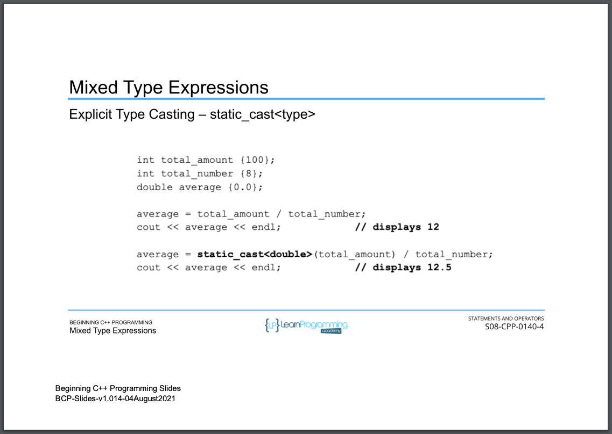

# 68. Mixed Expressions and Conversions

<p align="center" >
           
           
           
           
     
</p> 

<details>
  <summary> Section 8: Statements and Operators </summary>

  -   using `g++`
  ```
  g++ -Wall -std=c++14 main.cpp  
  ```

  - [Codebase: 68. Mixed Expressions and Conversions](../codebase/S8_Statements-and-Operators/MixedExpressions/)

</details>


---

[Previous](./67_Increment-and-Decrement-Operators.md) | [Next](./69_Testing-for-Equality.md)
