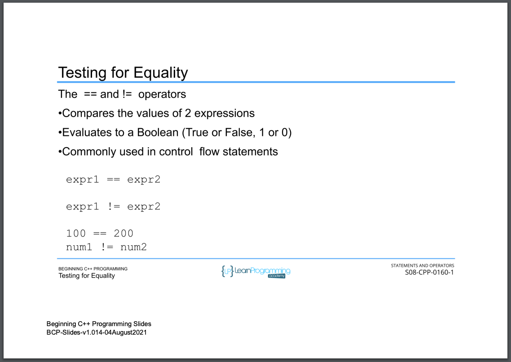
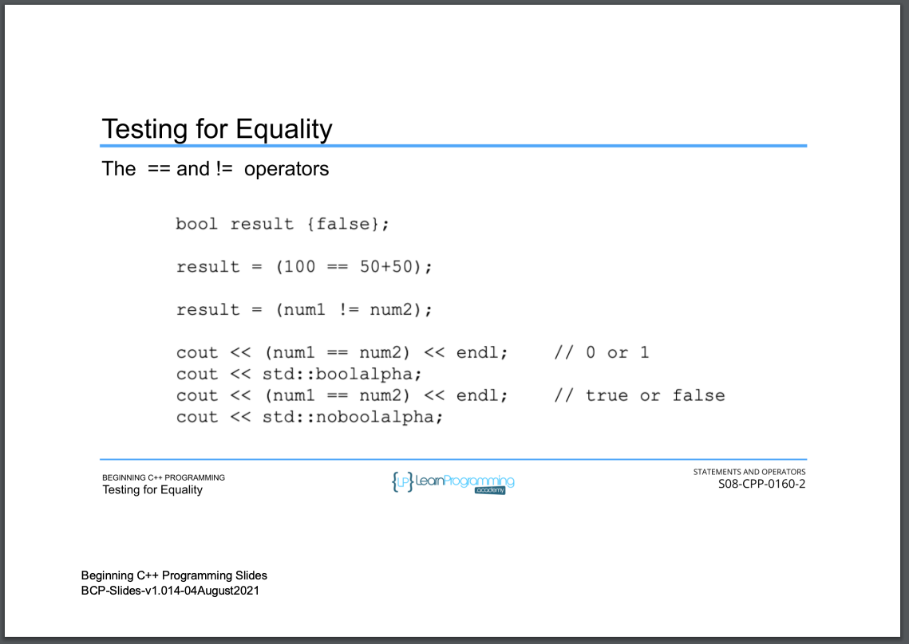

# 69. Testing for Equality

<p align="center" >
           
           
     
</p> 

<details>
  <summary> Section 8: Statements and Operators </summary>

  -   using `g++`
  ```
  g++ -Wall -std=c++14 main.cpp  
  ```

  - [Codebase: 69. Testing for Equality](../codebase/S8_Statements-and-Operators/EqualityOperators/)

</details>


---

[Previous](./68_Mixed-Expressions-and-Conversions.md) | [Next](./70_Relational-Operators.md)
