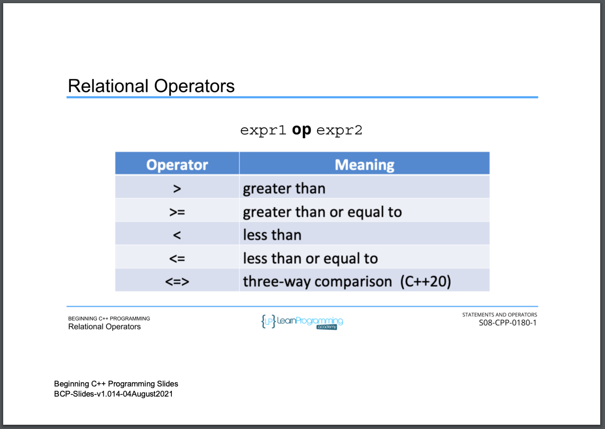

# 70. Relational Operators (p111)

<p align="center" >
      
     
</p> 

<details>
  <summary> Section 8: Statements and Operators </summary>

  -   using `g++`
  ```
  g++ -Wall -std=c++14 main.cpp  
  ```

  - [Codebase: 70. Relational Operators](../codebase/S8_Statements-and-Operators/RelationalOperators/)

</details>


---

[Previous](./69_Testing-for-Equality.md) | [Next](./71_Logical-Operators.md)
