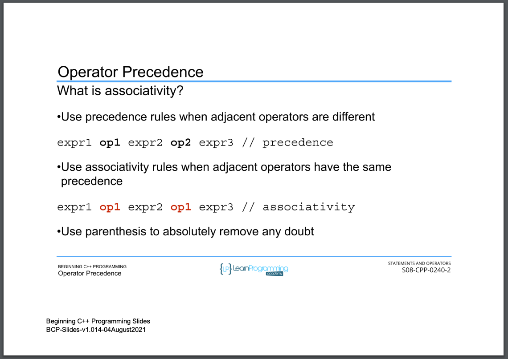

# 73. Operator Precedence

<p align="center" >
         
         
         
     
</p> 

<details>
  <summary> Section 8: Statements and Operators </summary>

  -   using `g++`
  ```
  g++ -Wall -std=c++14 main.cpp  
  ```

  - [Codebase: 73. Operator Precedence](../codebase/S8_Statements-and-Operators/)

</details>


---

[Previous](./72_Compound-Assignment-Operators.md) | [Next](./74_Section-Challenge.md)
