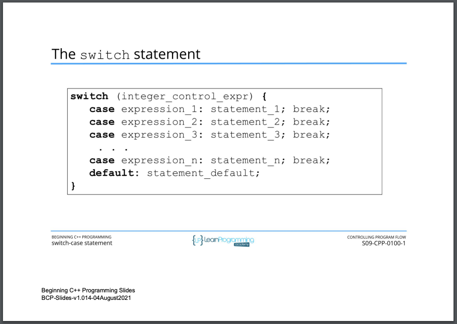
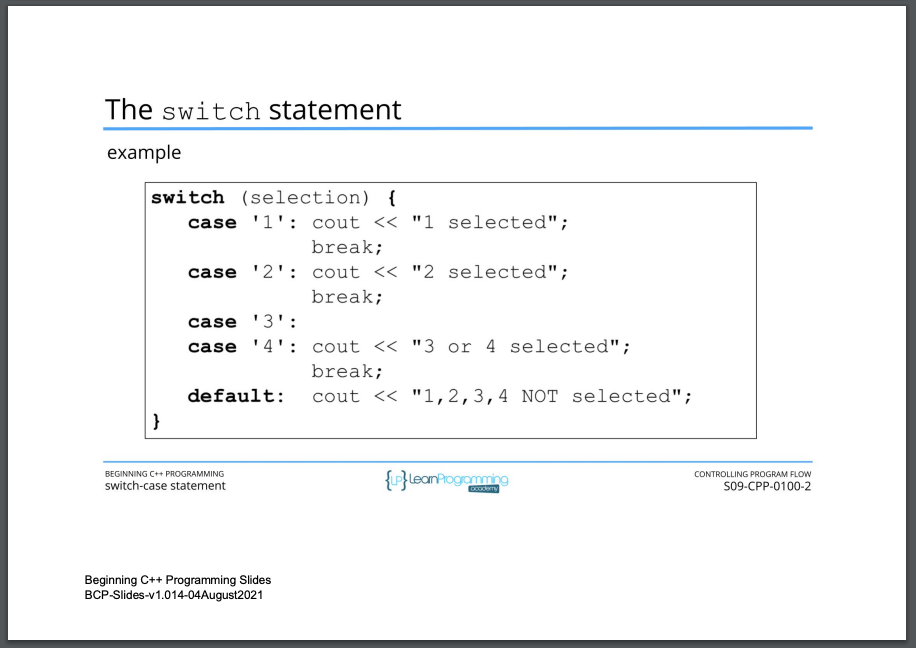
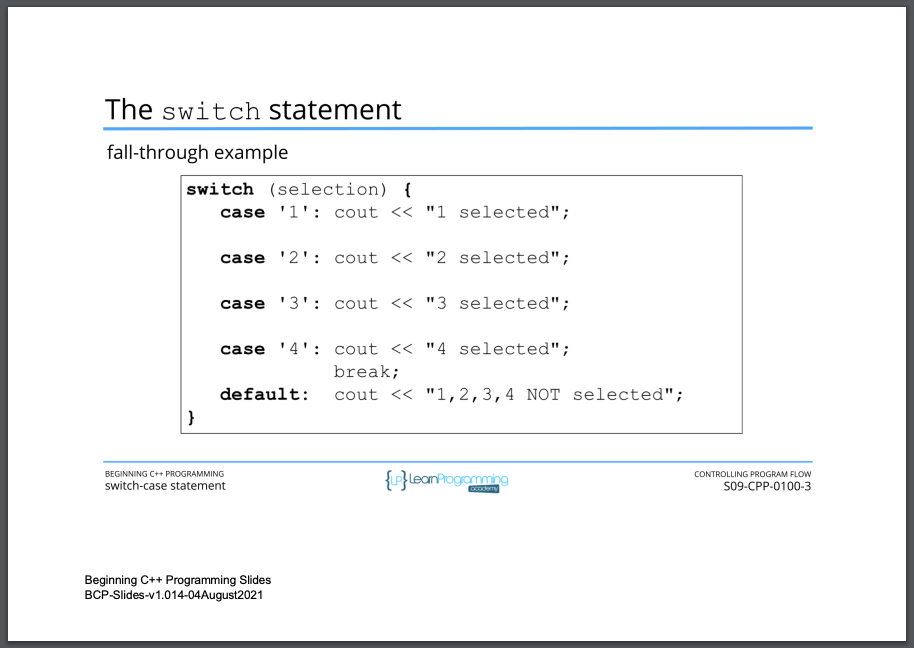
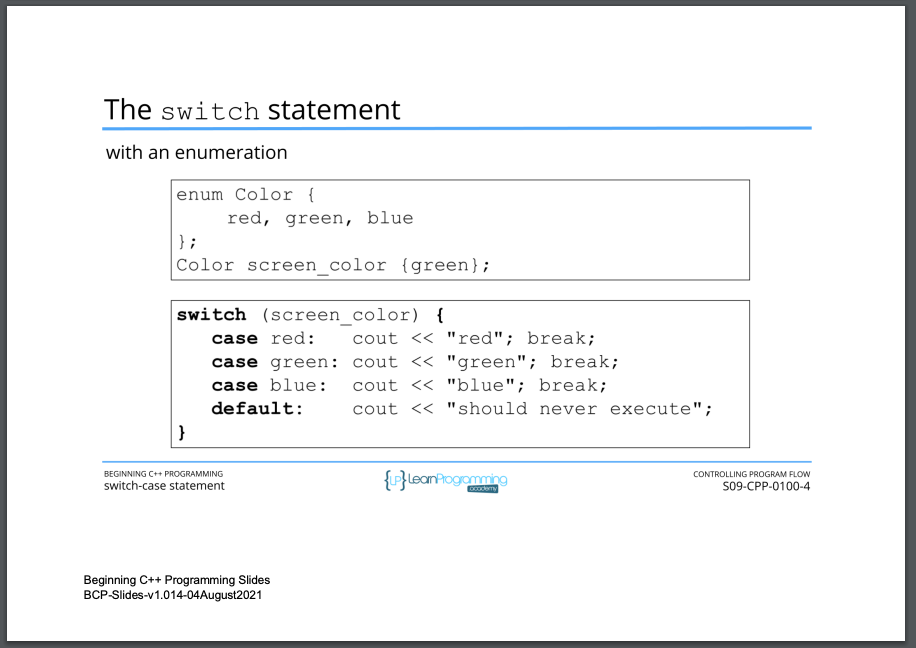
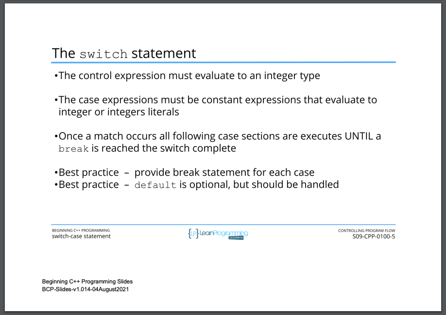

# 80. switch-case Statement (p141)

<p align="center" >
     
     
     
     
     
               
</p> 


<details>
  <summary> Section 9: Controlling Program Flow </summary>

  -   using `g++`
  ```
  g++ -Wall -std=c++14 main.cpp  
  ```

  - [Codebase: 80. switch-case Statement](../codebase/S9_Controlling-Program-Flow/Switch/)

  - [Codebase: 80. switch-case Statement - Enum](../codebase/S9_Controlling-Program-Flow/SwitchEnum/)

</details>


---

[Previous](./79_Nested-if-Statements.md) | [Next](./81_Conditional-Operator.md)