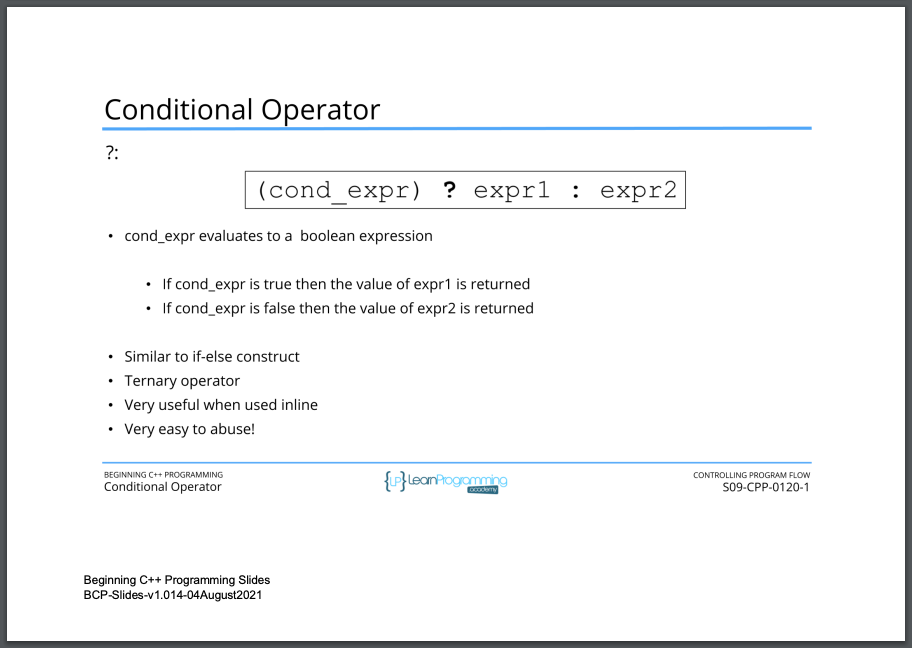
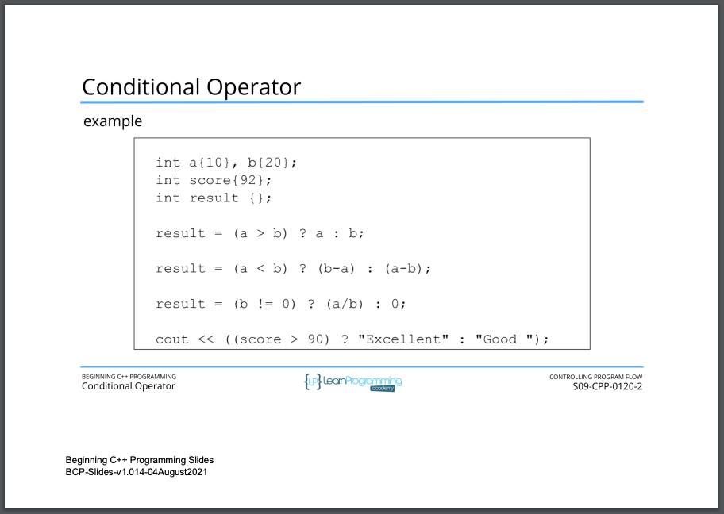

# 81. Conditional Operator

<p align="center" >
     
     
               
</p> 


<details>
  <summary> Section 9: Controlling Program Flow </summary>

  -   using `g++`
  ```
  g++ -Wall -std=c++14 main.cpp  
  ```

  - [Codebase: 81. Conditional Operator](../codebase/S9_Controlling-Program-Flow/ConditionalOperator/)

</details>


---

[Previous](./80_switch-case-Statement.md) | [Next](./82_Looping.md)