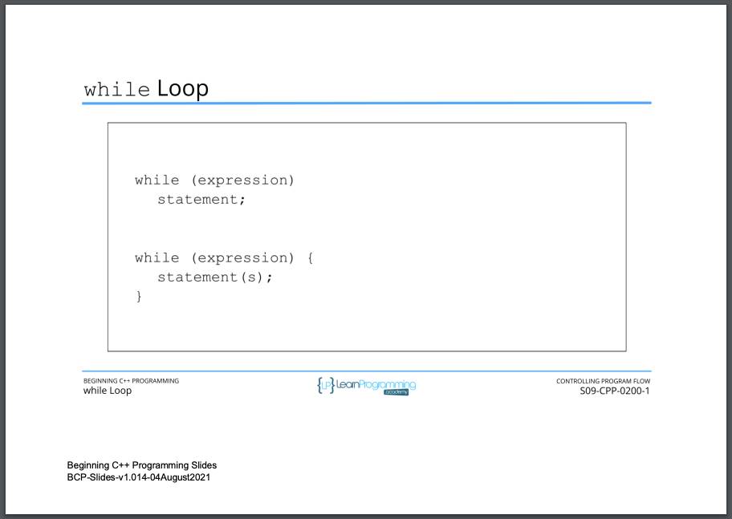
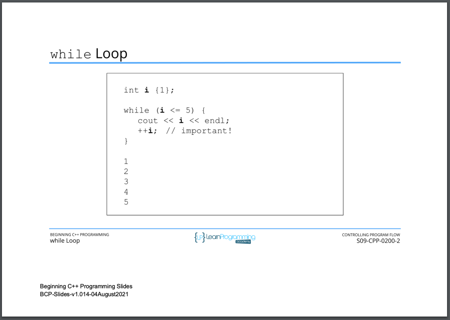
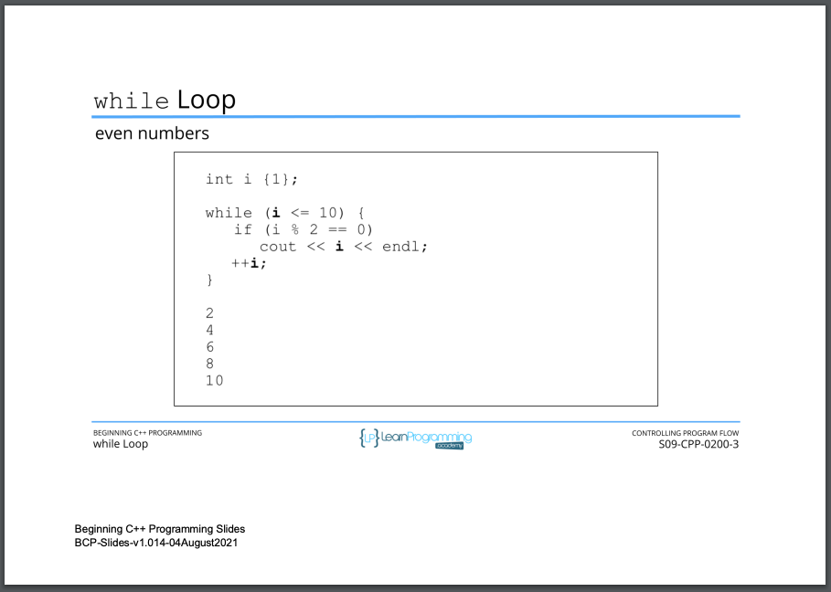
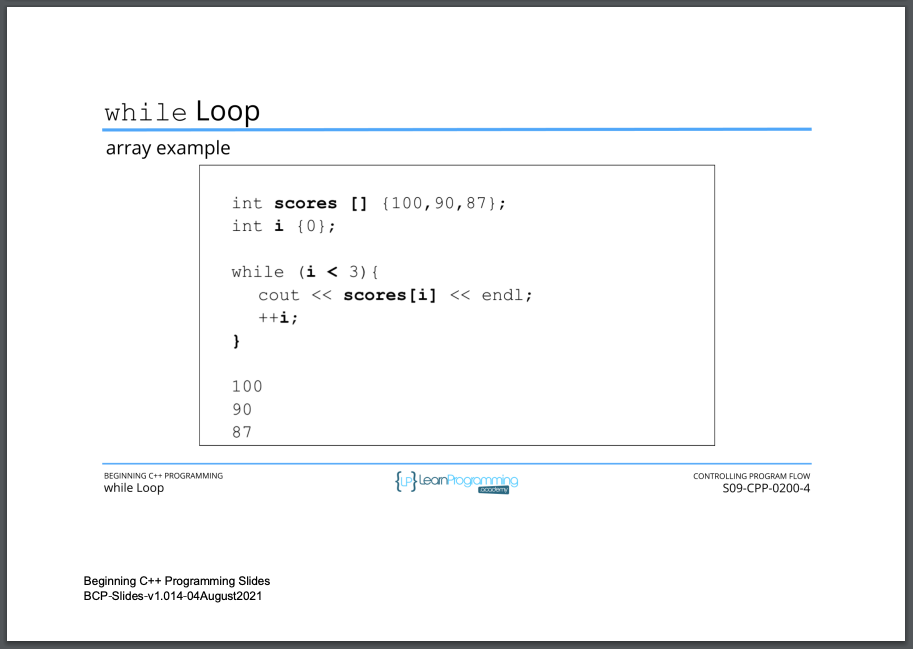
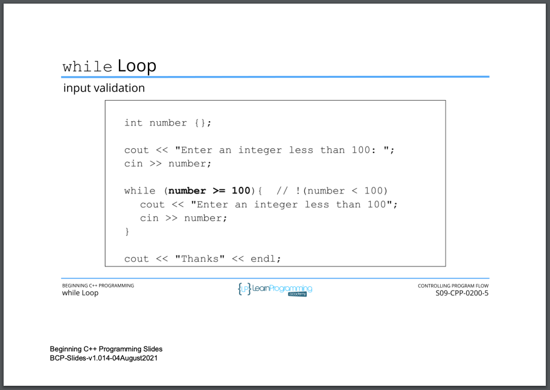
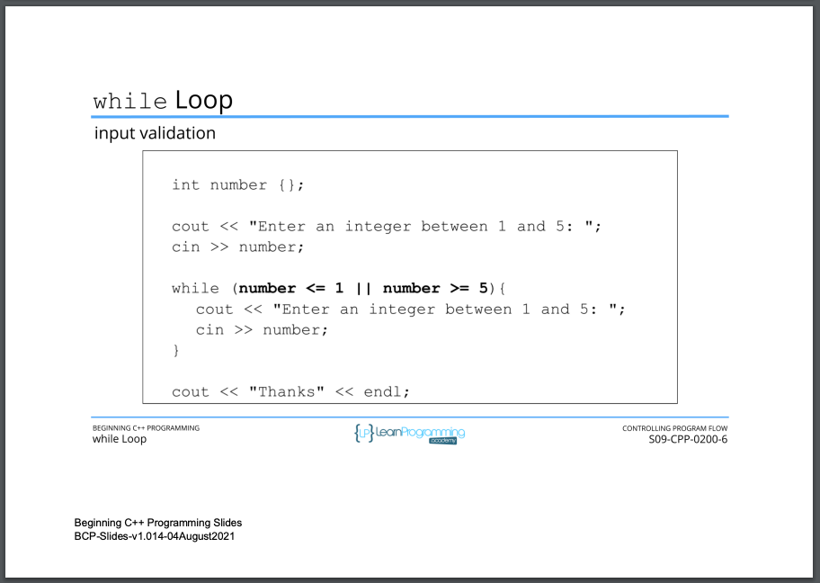
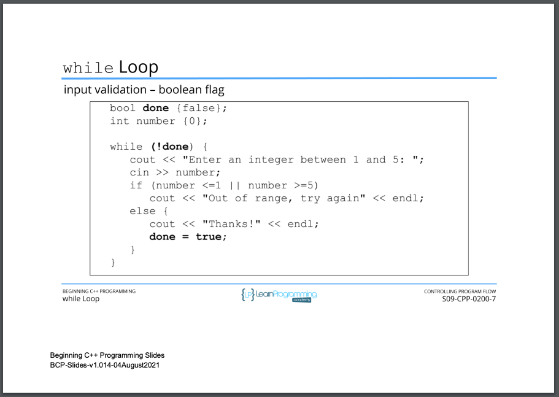

# 85. while Loop

-   [While loop exercise](../codebase/S9_Controlling-Program-Flow/While-loop-exercise/Readme.md)

<p align="center" >
     
     
     
     
     
     
     
               
</p> 


<details>
  <summary> Section 9: Controlling Program Flow </summary>

  -   using `g++`
  ```
  g++ -Wall -std=c++14 main.cpp  
  ```
  - using `-Wextra` and `-Wpedantic` options enable additional warning checks beyond the `-Wall` option, e.g. `-Wmisleading-indentation`
  ```
  g++ -Wall -Wextra -Wpedantic -Wmisleading-indentation -std=c++17 main.cpp
  ```

  - [Codebase: 85. while Loop](../codebase/S9_Controlling-Program-Flow/WhileLoop/)

</details>

<details>
  <summary> While loop exercise </summary>

  -   using `g++`
  ```
  g++ -Wall -std=c++14 main.cpp  
  ```
  - using `-Wextra` and `-Wpedantic` options enable additional warning checks beyond the `-Wall` option, e.g. `-Wmisleading-indentation`
  ```
  g++ -Wall -Wextra -Wpedantic -Wmisleading-indentation -std=c++17 main.cpp
  ```

  - [Codebase: While loop exercise - main.cpp](../codebase/S9_Controlling-Program-Flow/While-loop-exercise/main.cpp)

</details>


---

[Previous](./84_range-based-for-Loop.md) | [Next](./86_do-while-Loop.md)