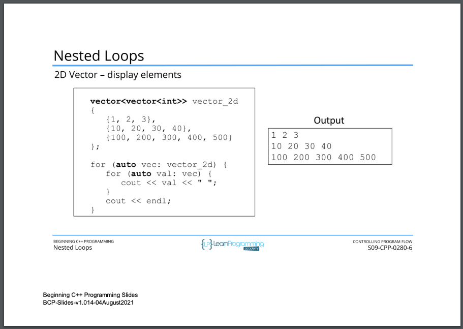

# 89. Nested Loops

<p align="center" >
     
         
         
         
         
         
               
</p> 


<details>
  <summary> Section 9: Controlling Program Flow </summary>

  -   using `g++`
  ```
  g++ -Wall -std=c++14 main.cpp  
  ```
  - using `-Wextra` and `-Wpedantic` options enable additional warning checks beyond the `-Wall` option, e.g. `-Wmisleading-indentation`
  ```
  g++ -Wall -Wextra -Wpedantic -Wmisleading-indentation -std=c++17 main.cpp
  ```

  - [Codebase: 89. Nested Loops](../codebase/S9_Controlling-Program-Flow/MultiplcationTable/)

</details>


---

[Previous](./88_Infinite-Loops.md) | [Next]()