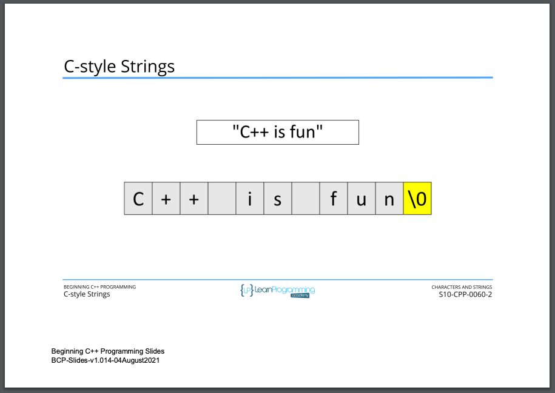

# 95. C-Style Strings (p191)

<p align="center" >
     
     
     
     
     
     
     
     
               
</p> 

<details>
  <summary> Section 10: Characters and Strings </summary>

  -   using `g++`
  ```
  g++ -Wall -std=c++14 main.cpp  
  ```
  - using `-Wextra` and `-Wpedantic` options enable additional warning checks beyond the `-Wall` option, e.g. `-Wmisleading-indentation`
  ```
  g++ -Wall -Wextra -Wpedantic -Wmisleading-indentation -std=c++17 main.cpp
  ```

  - [Codebase: 95. C-Style Strings](../codebase/S10_Characters-and-Strings/Practice/)

</details>


---

[Previous](./94_Character-Functions.md) | [Next](./96_Working-with-C-style-Strings.md)